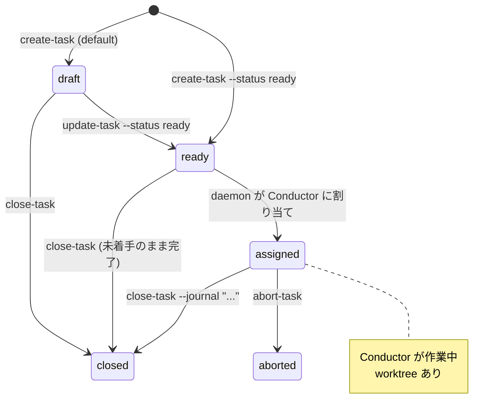
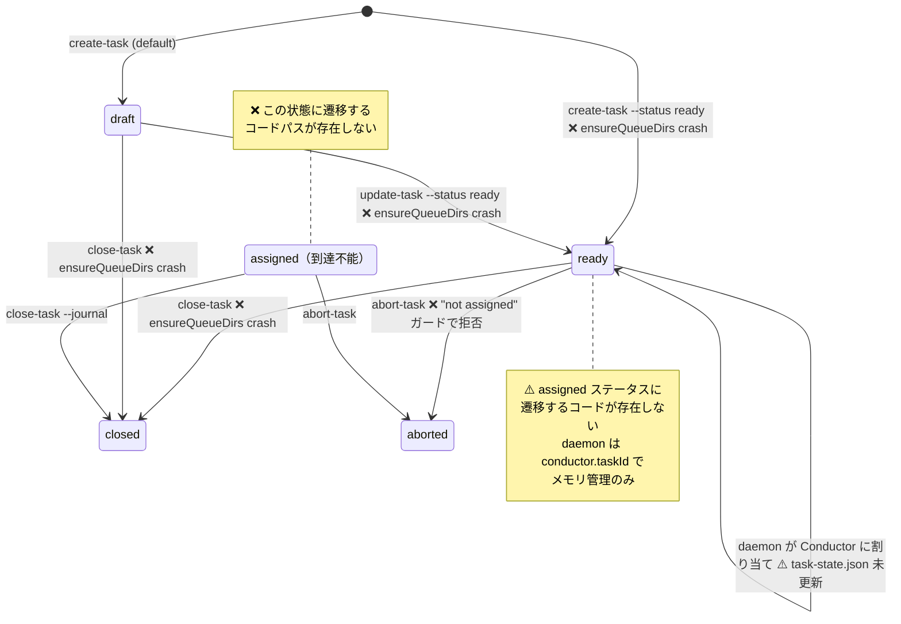
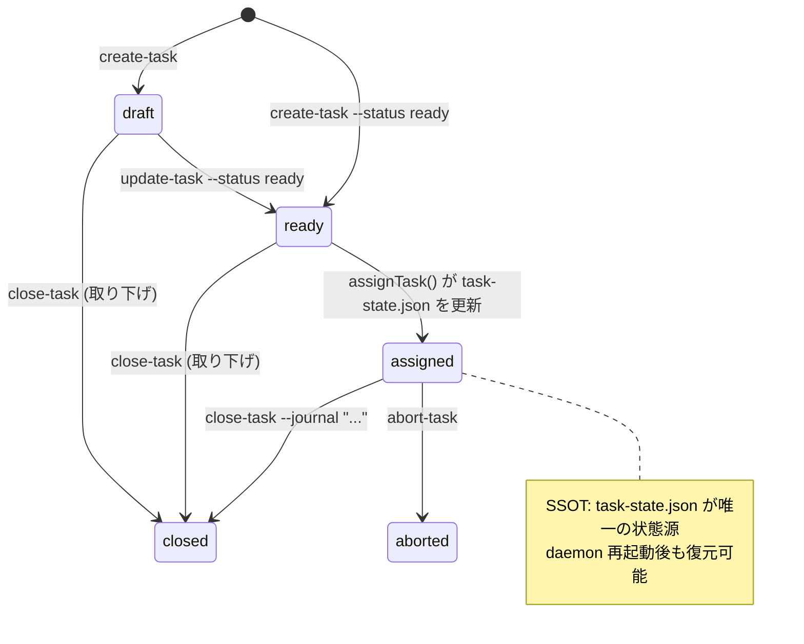

## 設計上のステート図（task-state.json の TaskState 型定義より）

## 実装上のステート図（実際のコードの挙動）

## 問題一覧

### 問題 1: `assigned` ステータスへの遷移が存在しない

**設計**: daemon がタスクを Conductor に割り当てる際に `task-state.json` を `assigned` に更新すべき

**実装**: `conductor.ts:assignTask()` は `ConductorState.status = "running"` にするだけで、`task-state.json` を一切更新しない。daemon の `tick()` は `conductor.taskId` からメモリ上で `assignedIds` を動的算出しているため二重割り当ては防げているが、永続化層（task-state.json）には反映されない。

**影響**:
- TUI やCLI で表示されるタスクステータスが常に `ready` のまま
- `abort-task` が `assigned` ガードで拒否される（ステータスが `ready` なので）
- daemon 再起動時に「割り当て済みタスク」の情報が消失する可能性

### 問題 2: `ensureQueueDirs` / `sendMessage` が未定義

**原因**: T070 で queue.ts を削除した際に、main.ts の6箇所の呼び出しが残存

**影響**: 以下のコマンドが `--status ready` 関連のパスを通ると crash:
- `create-task --status ready` (L1092)
- `update-task --status ready` (L1180)
- `close-task` (L1345)
- `abort-task` (L1341 — sendMessage)
- `spawn-conductor` (L778)
- `spawn-agent` (L924)

### 問題 3: `abort-task` が ready タスクに使えない

**設計**: `abort-task` は `assigned` 限定（L1266 ガード）

**現実**: `assigned` に遷移するコードがないため、abort-task は実質どのタスクにも使えない

### 問題 4: タスクステータスの情報源が二重化

| 情報源 | 管理対象 | 更新者 |
|--------|---------|--------|
| `task-state.json` | draft / ready / closed / aborted | CLI コマンド（main.ts） |
| `ConductorState.taskId` | 割り当て中のタスク | daemon（メモリ上） |

「このタスクは割り当て済みか？」の判定が2箇所に分散しており、SSOT になっていない。

## あるべき姿

### 修正方針

1. `conductor.ts:assignTask()` 内で `task-state.json` の status を `assigned` に更新する
2. `ensureQueueDirs` / `sendMessage` を HTTP API (`POST /api/messages`) に置換する
3. `abort-task` を `ready` タスクにも使えるようにする（ready → closed で取り下げ、assigned → aborted で中止）
4. daemon 再起動時に `task-state.json` の `assigned` を参照して Conductor との紐付けを復元する
