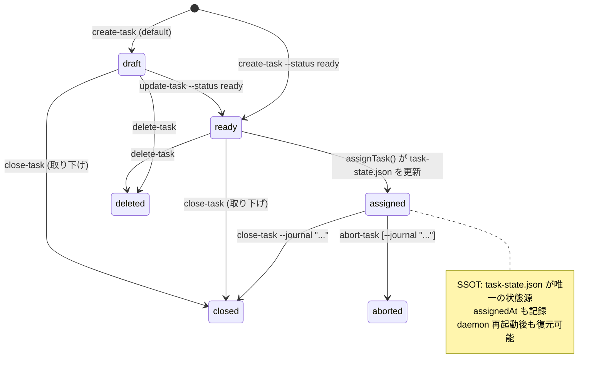

## ステート図（設計 = 実装）

T061, T070, T077, T109, T110 の修正により、設計と実装が一致した。

## 修正済み問題一覧

### 問題 1: `assigned` ステータスへの遷移が存在しない → ✅ 修正済み (T110)

`daemon.ts:scanTasks()` 内で `assignTask()` 成功時に `task-state.json` を `assigned` + `assignedAt` に更新するようになった。

### 問題 2: `ensureQueueDirs` / `sendMessage` が未定義 → ✅ 修正済み (T070, T077)

queue.ts を削除し、全メッセージングを HTTP API (`POST /api/messages`) に移行。`ensureQueueDirs` / `sendMessage` の呼び出しは完全に除去された。

### 問題 3: `abort-task` が ready タスクに使えない → ✅ 修正済み (T061, T109)

`abort-task` コマンドを実装。assigned 状態のタスクを中止可能（PID kill・worktree 削除・Conductor 再起動）。journal オプション対応。draft/ready のタスクには `delete-task` を使用する設計。

### 問題 4: タスクステータスの情報源が二重化 → ✅ 修正済み (T110)

`task-state.json` が SSOT。`assignedAt` フィールドも追加され、daemon 再起動時に assigned タスクを正しく復元可能。
