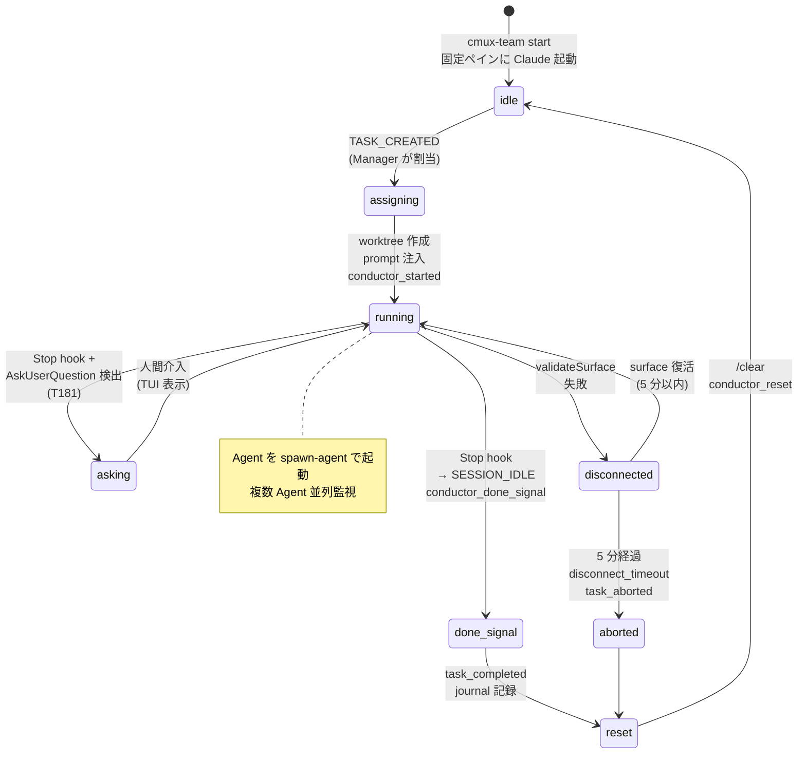
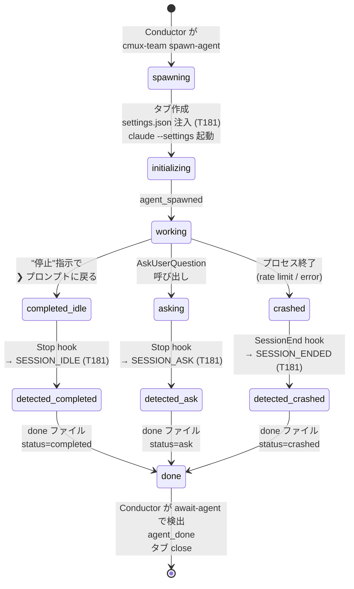
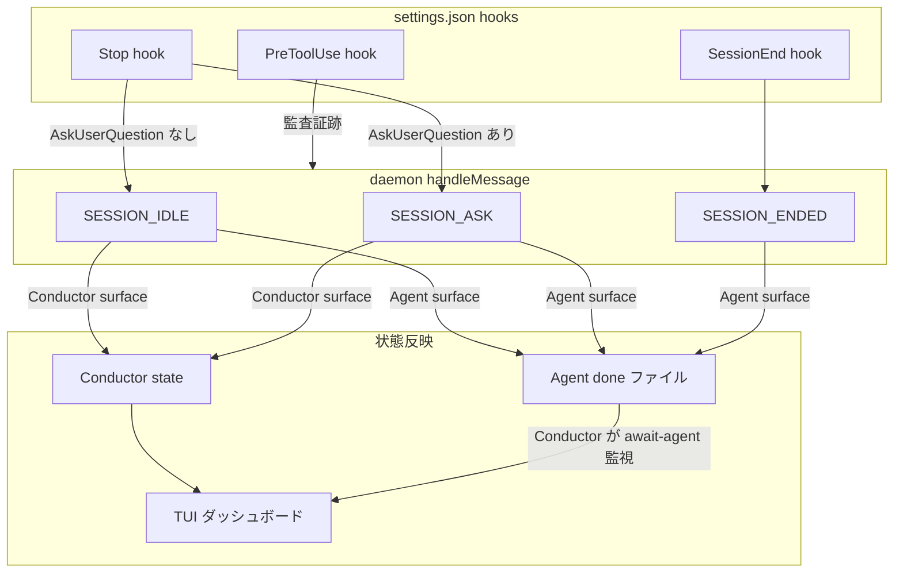

# Conductor / Agent ライフサイクル

cmux-team の 4 層アーキテクチャ（Master → Manager → Conductor → Agent）のうち、Conductor と Agent の状態遷移を可視化する。検出メカニズムは Claude Code の hook（`settings.json`）に依存しており、prompt 本文やその frontmatter では制御しない。

## Conductor ライフサイクル

## Agent ライフサイクル

## 遷移イベント対応表

| 遷移 | トリガー | ログイベント |
|------|---------|------|
| Conductor idle → running | `TASK_CREATED` メッセージ | `conductor_started` |
| Conductor running → done | Stop hook → SESSION_IDLE | `conductor_done_signal` |
| Conductor running → disconnected | `validateSurface` 失敗 | `conductor_disconnected` |
| Conductor → aborted | 5 分経過 | `task_aborted reason=disconnect_timeout` |
| Conductor → reset | done / aborted 確定 | `conductor_reset` |
| Agent spawn | `cmux-team spawn-agent` CLI | `agent_spawned` |
| Agent 完了（プロセス存続） | Stop hook → SESSION_IDLE | `agent_done trigger=idle` (T181 後) |
| Agent 質問 | Stop hook + AskUserQuestion 検出 | `agent_done trigger=ask` (T181 後) |
| Agent クラッシュ | SessionEnd hook → SESSION_ENDED | `agent_done trigger=session_ended` |

## 検出メカニズムの分担

## 既存実装の欠落点（T181 で埋める）

| 項目 | 現状 | T181 後 |
|------|------|---------|
| Conductor Stop hook | 設定済み | 変更なし（AskUserQuestion 検出を追加） |
| Conductor SessionEnd hook | 設定済み | 変更なし |
| **Agent Stop hook** | **未設定** | **新設（`generateAgentSettings()`）** |
| **Agent SessionEnd hook** | **未設定** | **新設** |
| Agent 完了検出 | `surface_lost` のみ（プロセス存続時は検出不可） | Stop hook で確実に検出 |
| Agent ask 検出 | 不可 | SESSION_ASK で検出 |
| Conductor が Agent を待つ方法 | ポーリング（30 秒間隔 read-screen） | `cmux-team await-agent` で done ファイル監視 |

## 設計原則との整合

- **pull 型監視**: Agent が done ファイルを書き、Conductor が await-agent で取りに行く
- **決定論的なものはコードで**: hook による検出は文字列マッチに依存しない（JSONL トランスクリプト構造で判定）
- **各層は自分の仕事だけをする**: Agent は作業して done ファイルを書くだけ、Conductor は待って解釈するだけ

## 参考

- T181（ready 待ち・本 artifact 作成時点 draft）: await-agent 方式への移行と Ask 状態検出対応
- `skills/cmux-team/manager/daemon.ts:670-710`: `handleMessage` SESSION_IDLE / SESSION_ENDED 処理
- `skills/cmux-team/manager/main.ts:922`: `generateConductorSettings`（Agent 版は T181 で新設）
- `skills/cmux-team/templates/ja/common-header.md`: 「作業が完了したら停止してください」— Agent 向け方針指示（検出メカニズムは hook 側）
