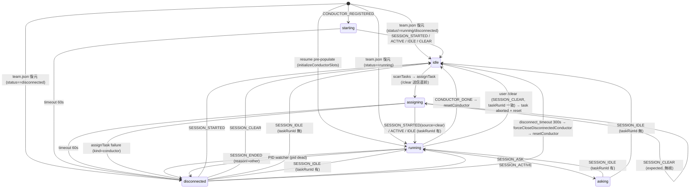

# Conductor 状態機械の網羅的文書化（2026-04-18 時点）

> 本ドキュメントは cmux-team `v3.53.0` 時点の `skills/cmux-team/manager/` 実装に基づく現状記述です。新設計・改善案は含みません。引用箇所はすべて `file:line` 形式で裏取りしています。

## 1. 状態一覧

`ConductorState.status` の型定義は以下の 6 値です（schema.ts:205）。

```ts
status: "starting" | "assigning" | "idle" | "running" | "asking" | "disconnected";
```

| 状態 | 意味 | 想定滞在時間 | 備考 |
|------|------|--------------|------|
| `starting` | Conductor pane 内で `cmux-team conductor`（または `resume`）が起動中。Claude プロセスが立ち上がり SESSION_STARTED hook が届くまでの過渡期。`CONDUCTOR_REGISTERED` 受信時にセットされる（daemon.ts:1231）。 | 数秒〜 60 秒（`STARTING_TIMEOUT_SEC`=60 秒, daemon.ts:2056）。超過すると `disconnected` へ強制遷移。 | resume 経路（`initializeConductorSlots`）では Conductor state は `running` で pre-populated されるため、starting は通らない（conductor.ts:237）。 |
| `assigning` | `assignTask` が `/clear` を送信する直前にセットされる状態（conductor.ts:376）。daemon 自身が送った `/clear` 発火で届く `SESSION_CLEAR` を `user_clear` と誤認しないためのガード窓。 | 数秒〜 60 秒（`ASSIGNING_TIMEOUT_SEC`=60, daemon.ts:2064）。超過で `disconnected`。 | 実測では `/clear` 送信から `SESSION_STARTED(source=clear)` 到達まで ~10 秒（daemon.ts:2060 のコメント）。 |
| `idle` | タスク未割当の待機状態。`scanTasks` は `c.status === "idle"` の Conductor のみ `assignTask` 対象にする（daemon.ts:1802）。 | 任意。task が来るまで。 | `resetConductor` がこの状態に戻す終端状態（conductor.ts:502）。 |
| `running` | タスク実行中。`assigning` 状態で送信した `/clear` が完了し、`SESSION_STARTED(source=clear)` / `SESSION_IDLE` / `SESSION_ACTIVE` のいずれかを受けて遷移する（daemon.ts:1071-1077, 1411-1418, 1512-1519）。 | タスク完了まで（無制限）。PID 生存確認は `spawnPidWatcher` が 1 秒間隔で担う（daemon.ts:1918）。 | `CONDUCTOR_DONE` 受信で `handleConductorDone → resetConductor` により `idle` に戻る。 |
| `asking` | `SESSION_ASK`（AskUserQuestion 検出）受信時の一時状態。`conductor.askQuestion` に質問本文を保持（daemon.ts:1572-1574）。 | ユーザー応答が返って次の `SESSION_IDLE` が来るまで。 | 解除時は `taskRunId` の有無で `running` / `idle` に分岐（daemon.ts:1488）。 |
| `disconnected` | Claude セッションが死亡 / 切断された、またはタイムアウトで倒された状態。`conductor.disconnectedAt` に遷移時刻を保持。`spawnPidWatcher` の PID 不在検出（daemon.ts:1896-1898）、`SESSION_ENDED`（`reason !== "other"`, daemon.ts:1343）、timeout 各種、`assignTask` 失敗（kind=conductor, daemon.ts:1845）から入る。 | 最大 `DISCONNECT_TIMEOUT_SEC`=300 秒（daemon.ts:2066）。超過で `forceCloseDisconnectedConductor` → タスク abort + reset。 | 復帰パス: `SESSION_STARTED`（→ `idle`, daemon.ts:1064-1066）, `SESSION_ACTIVE`（→ `running`, daemon.ts:1405-1407）, `SESSION_IDLE`（`taskRunId` 有無で `running`/`idle`, daemon.ts:1493-1508）, `SESSION_CLEAR`（→ `idle`, daemon.ts:1640-1646）。 |

※ 実装外の別概念として、タスク状態（`task-state.json`）には `aborted` があるが、これは Conductor.status とは別のレイヤー（タスク側）に存在する。`forceCloseDisconnectedConductor` / user `/clear` / assignTask 失敗時に task-state のみ `aborted` に書かれる。

### 1.1 Agent 状態（補足）

`AgentState.status` は 4 値（schema.ts:159）。本ドキュメントでは参考まで列挙。

```
status: "starting" | "running" | "idle" | "asking";
```

- `starting`: `AGENT_SPAWNED` 受信時（daemon.ts:1030）
- `running`: `SESSION_STARTED` で上書き（daemon.ts:1145）
- `idle`: `SESSION_IDLE` で上書き、agents 配列には残留（daemon.ts:1543）
- `asking`: `SESSION_ASK` で上書き（daemon.ts:1600）

Agent は `disconnected` を持たず、PID 消失 / `SESSION_ENDED` で `writeAgentDone(status=crashed|completed)` + agents 配列から削除（daemon.ts:1358, 1955, 1962）。

## 2. 遷移表

`from` は遷移前の `conductor.status`、`to` は遷移後。トリガー signal・ガード条件・副作用を記載する。

| # | from | to | トリガー | ガード条件 | 副作用（ログ・ファイル・surface） | 実装位置 |
|---|------|----|--------|-----------|----------------------------------|---------|
| 1 | (新規) | `starting` | `CONDUCTOR_REGISTERED` 受信 | `state.conductors.has(surface)` が false（idempotent） | `state.conductors.set(surface, {status:"starting",startedAt,agents:[]})` + log `conductor_registered` | daemon.ts:1229-1236 |
| 2 | `starting` | `idle` | `SESSION_STARTED` / `SESSION_ACTIVE` / `SESSION_IDLE` / `SESSION_CLEAR` | なし | `pid`/`sessionId` 更新、`disconnectedAt=undefined`、log `conductor_ready`、`spawnPidWatcher` 起動（SESSION_STARTED 時） | daemon.ts:1064-1070, 1408-1410, 1509-1511, 1640-1646 |
| 3 | `starting` | `disconnected` | timeout（`elapsed > 60s`） | 経過時間（`Date.now() - startedAt`）> 60 秒 | `disconnectedAt=now`、log `conductor_start_timeout` | daemon.ts:2079-2088 |
| 4 | `idle` | `assigning` | `scanTasks → assignTask`（`/clear` 送信直前） | idle Conductor が存在し executable タスクがある | log `conductor_started`、`notifyStateChanged` | conductor.ts:376-377, 428-431 |
| 5 | `assigning` | `running` | `SESSION_STARTED`（source=clear 他） | 通常ケース | `pid`/`sessionId` 更新、log `conductor_running via=SESSION_STARTED source=...` | daemon.ts:1071-1077 |
| 6 | `assigning` | `running` | `SESSION_ACTIVE` | `conductor.taskRunId` が truthy | log `conductor_running via=SESSION_ACTIVE` | daemon.ts:1411-1418 |
| 7 | `assigning` | `running` | `SESSION_IDLE` | `conductor.taskRunId` が truthy | log `conductor_running via=SESSION_IDLE` | daemon.ts:1512-1519 |
| 8 | `assigning` | (no-op / ignored) | `SESSION_CLEAR` | status が `assigning` | **destructive 処理をスキップ**（`user_clear` 誤認防止）、log `session_clear_expected reason=daemon_assign_clear` | daemon.ts:1633-1638 |
| 9 | `assigning` | `disconnected` | timeout（`elapsed > 60s`） | 経過時間（`startedAt`）> 60 秒 | `disconnectedAt=now`、log `conductor_assign_timeout taskRunId=<id>` | daemon.ts:2094-2104 |
| 10 | `assigning` | `disconnected` | `assignTask` 失敗（kind=conductor） | `cmux send` 失敗等 | `disconnectedAt=now`、log `conductor_disconnected reason=assign_failed kind=conductor` | daemon.ts:1845-1851 |
| 11 | `running` | `idle` | `CONDUCTOR_DONE` → `handleConductorDone → resetConductor` | `conductor.status === "running"` または `taskRunId !== null`（late_cleanup 経路）／ `taskRunId` 一致 | log `task_completed`、`resetConductor`: surface 子タブ close、worktree 削除、ブランチ削除、state クリア、`disconnectedAt=undefined`、log `conductor_reset` | daemon.ts:986-1019, 2180-2202, conductor.ts:457-519 |
| 12 | `running` | `disconnected` | PID 消失検出 | `cmux.isAlive(pid)===false` かつ `conductor.pid === pid` | `pid=undefined`、`disconnectedAt=now`、log `session_ended ... reason=pid_watcher` | daemon.ts:1896-1905 |
| 13 | `running` | `disconnected` | `SESSION_ENDED`（reason !== "other"） | `message.surface === conductor.surface` | `pid=undefined`、`disconnectedAt=message.timestamp`、log `session_ended status=disconnected reason=...` | daemon.ts:1299-1350 |
| 14 | `running` | `asking` | `SESSION_ASK` | Conductor surface にマッチ | `askQuestion` set、`disconnectedAt=undefined`、log `conductor_asking` | daemon.ts:1571-1579 |
| 15 | `running` | `running` (self) | `SESSION_STARTED(source=clear)` | via=SESSION_STARTED, conductor.status===running | `sessionId`/`pid` 更新。注: /clear で旧 Claude が死に新 pid が届く経路（daemon.ts:1686 参照）とは独立。`task-state.json.sessionId` を最新値に同期（daemon.ts:1087-1126） | daemon.ts:1087-1126 |
| 16 | `running` | `idle` | ユーザー手動 `/clear`（`SESSION_CLEAR`） | status が `running` かつ `taskRunId` 不一致でない | task-state を `aborted` に更新（journal=`user_clear: ...`）、`pidWatcherInterval` クリア、`pid=undefined`、`resetConductor` | daemon.ts:1664-1689 |
| 17 | `asking` | `running` / `idle` | `SESSION_IDLE` | `conductor.taskRunId` 有無で分岐 | `askQuestion=undefined`、log `conductor_ask_resolved new_status=...` | daemon.ts:1486-1492 |
| 18 | `disconnected` | `idle` | `SESSION_STARTED` | なし | `pid`/`sessionId` 更新、log `conductor_recovered` | daemon.ts:1064-1070 |
| 19 | `disconnected` | `running` | `SESSION_ACTIVE` | なし | `pid` 更新、`disconnectedAt=undefined`、log `conductor_recovered via=SESSION_ACTIVE new_status=running` | daemon.ts:1405-1407 |
| 20 | `disconnected` | `running` | `SESSION_IDLE` | `conductor.taskRunId` truthy | log `conductor_recovered via=SESSION_IDLE new_status=running taskRunId=...`。reset は走らせない（生存中の worktree 誤削除防止, コメント daemon.ts:1496-1498） | daemon.ts:1493-1503 |
| 21 | `disconnected` | `idle` | `SESSION_IDLE` | `taskRunId` なし | log `conductor_recovered via=SESSION_IDLE` | daemon.ts:1504-1508 |
| 22 | `disconnected` | `idle` | `SESSION_CLEAR` | なし（destructive でないため taskRunId ガードなし） | `disconnectedAt=undefined`、log `conductor_recovered via=SESSION_CLEAR` | daemon.ts:1640-1646 |
| 23 | `disconnected` | `idle`（via forced cleanup） | timeout（`elapsed > 300s`） | `disconnectedAt` が set 済みかつ経過 > 300 秒 | `forceCloseDisconnectedConductor`: task-state を `aborted` 化（journal=`disconnect_timeout: ...`）、`pidWatcherInterval` クリア、`resetConductor`（worktree/ブランチ/子 surface 片付け、`status=idle`） | daemon.ts:2108-2121, 2128-2178 |
| 24 | (任意) | `disconnected` | `assignTask` 想定外例外 | `AssignTaskError` 以外 | log `assignTask unexpected`、`disconnectedAt=now` | daemon.ts:1857-1862 |
| 25 | `assigning`（task kind 例外時の保険） | `disconnected` | `assignTask` 失敗（kind=task）かつ status が `assigning` のまま | 現コードでは到達不能（防衛コード） | log `conductor_disconnected reason=assigning_stuck kind=task` | daemon.ts:1830-1840 |

### 2.1 遷移を引き起こさないシグナル

- `AGENT_SPAWNED`: Conductor の状態は遷移しない。単に `conductor.agents` 配列に push されるのみ（daemon.ts:1022-1037）。
- `SESSION_ENDED reason=other`: 無視される。log `session_ended_other_ignored ... recorded only, no state transition`（daemon.ts:1303-1309）。
- `SESSION_STOP`: 直接の遷移はない。`classifyStopPayload` で `SESSION_ASK` / `SESSION_IDLE` に再合成され、`handleMessage` に再入する（daemon.ts:1425-1457）。

## 3. Signal の種別と発生源

### 3.1 Hook 経由（`cmux-team send --from-stdin`）

Claude Code が発火し shell hook → `main.ts:buildMessageFromHookInput`（SESSION_STARTED/ENDED のみ）または CLI フラグ経由で daemon HTTP API `/api/messages` に POST される。生成される hook settings は `main.ts:generateConductorSettings` / `generateAgentSettings` / `generateMasterSettings` 参照。

| Signal | 発生源 | `source=` | payload | 用途 |
|--------|--------|-----------|---------|------|
| `SESSION_STARTED` | Claude Code `SessionStart` hook（matcher=""、全 source 許容, main.ts:1617） | `"startup"` / `"resume"` / `"clear"` / `"compact"`（schema.ts:45 の `z.enum`） | surface, pid, sessionId（hook stdin の `session_id`） | `starting/disconnected → idle` / `assigning → running` / `sessionId` 同期 |
| `SESSION_ENDED` | Claude Code `SessionEnd` hook（matcher=`clear` / `logout\|prompt_input_exit\|other`, main.ts:1636-1656） | n/a（`reason` フィールドを持つ） | surface, pid, reason（hook stdin の `reason` または matcher） | Conductor `running → disconnected`。reason=`other` は無視（ignored）。reason=`close-agent` は Agent 正常完了を示す（daemon.ts:1358） |
| `SESSION_CLEAR` | Claude Code `SessionEnd` hook（matcher=`clear`, main.ts:1638-1641） | n/a | surface, taskRunId, pid | Conductor 手動 `/clear` 検出（daemon 側 `/clear` との差別化は `assigning` ガードで行う） |
| `SESSION_STOP` | Claude Code `Stop` hook（`detect-ask.sh` forwarder, main.ts:1258-1280） | n/a | surface, pid, payload.transcript_path | Manager 側で `classifyStopPayload` を走らせ `SESSION_ASK` or `SESSION_IDLE` に再合成 |

### 3.2 Conductor / Agent プロセスが直接 POST

- `CONDUCTOR_REGISTERED`: `cmdConductor` / `cmdResume` が claude 起動前に POST（self-register, T228）。daemon.ts:1191 で idempotent merge。
- `MASTER_REGISTERED`: `cmux-team spawn-master` 内の `registerSelfAsMaster` が POST（T230）。本書の対象外だが同経路。
- `AGENT_SPAWNED`: `spawn-agent` CLI が POST。Conductor の agents 配列に追加する。
- `CONDUCTOR_DONE`: Conductor 側から送信される完了通知。

### 3.3 Daemon 内部 signal

| Signal | 発生源 | 用途 |
|--------|--------|------|
| PID 消失検出 | `spawnPidWatcher`（1 秒間隔で `cmux.isAlive(pid)`, daemon.ts:1909-1926） | Conductor `running → disconnected`。log `session_ended ... reason=pid_watcher` |
| Agent PID 消失 | `spawnAgentPidWatcher`（1 秒間隔, daemon.ts:1981-1998） | `writeAgentDone(status=crashed, reason=pid_watcher)` + agents 削除 |
| `starting` timeout | `monitorConductors`（`tick` 毎 = `pollInterval`=10 秒既定） | `starting → disconnected`（daemon.ts:2079-2088） |
| `assigning` timeout | 同上 | `assigning → disconnected`（daemon.ts:2094-2104） |
| `disconnect` timeout | 同上 | `disconnected` → `forceCloseDisconnectedConductor`（daemon.ts:2108-2121） |

### 3.4 SessionStart `source` の意味（Claude Code 仕様）

`source` は Claude Code SessionStart hook の stdin JSON に含まれる値。`schema.ts:45` で `"startup" | "resume" | "clear" | "compact"` に型制約。

| source | 意味 | ハンドラ側の解釈（現行実装） |
|--------|------|-------------------------|
| `startup` | 新規 Claude プロセス起動 | 通常パス。Conductor が `starting → idle` / `assigning → running`。 |
| `resume` | `claude --resume` / `cmux-team resume` 経由の再開 | 上と同じ遷移。`sessionId` が task-state.json と一致すれば `task_session_updated` スキップ（stale guard）。 |
| `clear` | `/clear` コマンド後の再起動 | **`assigning` 状態からの `running` 遷移**を引き起こす主要トリガー。daemon が `/clear` を送った直後に発火する期待経路（daemon.ts:2060 コメント）。 |
| `compact` | `/compact` コマンド後の再起動 | 上と同じ遷移（分岐上の区別なし）。 |

現行コードは `message.source` をログには出すが（daemon.ts:1131, 1076）、**遷移分岐ロジックには使われていない**（source="startup" でも "clear" でも遷移先は同じ）。

## 4. Timeout の一覧

| 定数 | 値 | env override | 監視対象状態 | 条件 | timeout 時の挙動 | 実装位置 |
|------|----|----|-------------|------|----------------|---------|
| `STARTING_TIMEOUT_SEC` | 60 秒 | なし | `starting` | `(Date.now() - startedAt) / 1000 > 60` | `status = "disconnected"`、`disconnectedAt = now`、log `conductor_start_timeout`、notify | daemon.ts:2056, 2079-2088 |
| `ASSIGNING_TIMEOUT_SEC` | 60 秒 | なし | `assigning` | `(Date.now() - startedAt) / 1000 > 60` | `status = "disconnected"`、`disconnectedAt = now`、log `conductor_assign_timeout taskRunId=...`、notify | daemon.ts:2064, 2094-2104 |
| `DISCONNECT_TIMEOUT_SEC` | 300 秒 | `CMUX_TEAM_DISCONNECT_TIMEOUT_SEC` | `disconnected` | `(Date.now() - disconnectedAt) / 1000 > 300` | `forceCloseDisconnectedConductor`: task-state `aborted`、`pidWatcherInterval` クリア、`resetConductor` | daemon.ts:2066-2067, 2108-2121 |
| Agent PID watcher 間隔 | 1 秒 | なし | agent `running/idle/asking` | `cmux.isAlive(pid)===false` かつ agents 配列に残存 | `writeAgentDone(crashed, pid_watcher)`、agents から削除 | daemon.ts:1935-1998 |
| Conductor PID watcher 間隔 | 1 秒 | なし | `running` 等 | 同上 | status=`disconnected`、`disconnectedAt=now`、`pid=undefined`、log `session_ended reason=pid_watcher` | daemon.ts:1888-1926 |
| poll tick | 10000ms | `CMUX_TEAM_POLL_INTERVAL`（daemon.ts:daemon_started ログ参照） | 全 Conductor | 各 tick で `monitorConductors` を走らせる | 上 3 種の timeout 判定をトリガーする基盤 | daemon.ts:914-937 |
| `hook_signals` テーブル GC | 未実装 | なし | — | — | — | CLAUDE.md「運用上の注意（hook_signals GC）」 |

`tick` 周期は 10 秒なので、実際の timeout 発火は定数値 ± 10 秒以内に揺らぐ（T244 事例で `elapsed=61s`, `elapsed=301s` のような 1 秒超過が観測される原因）。

## 5. Invariant（暗黙の前提）

### 5.1 状態の排他性

- `conductor.status` は 6 値の排他 union。同時に複数 status を持たない（型制約）。
- `disconnectedAt` は `disconnected` 状態で set、それ以外への遷移時に必ず `undefined` に戻す（recovery パス daemon.ts:1083, 1403, 1483, 1575, 1643; reset パス conductor.ts:511）。
- `pidWatcherInterval` は Conductor 毎に最大 1 つ。新規 spawn 時に既存があれば `clearInterval` する（daemon.ts:1915-1917）。

### 5.2 Signal 順序の前提

- `CONDUCTOR_REGISTERED` は claude 起動の **前** に POST される（`cmdConductor` / `cmdResume` の self-register、daemon.ts:1209-1211 のコメント）。したがって `SESSION_STARTED` は必ず `CONDUCTOR_REGISTERED` 後に届く前提。
- ただし T234 で配送順逆転の race が観測されたため、`SESSION_STARTED` がどの surface にもマッチしないケースでは master として仮登録する fallback が入る（daemon.ts:1156-1187）。これは Conductor には適用されない。
- `AGENT_SPAWNED` は `SESSION_STARTED(agent)` よりも前に届く前提で、agents 配列を pre-create する（daemon.ts:1022-1037）。
- `/clear` 送信 → 10 秒程度で `SESSION_STARTED(source=clear)` が届く（daemon.ts:2060 コメントの実測値）。

### 5.3 `assigning` ガード

- `assigning` は `/clear` 送信の **直前** にセットする（conductor.ts:376-377）。先にセットすることで、daemon 自身が送った `/clear` の `SESSION_CLEAR` 発火を `user_clear` と誤認するのを防ぐ（daemon.ts:1629-1638 の early break）。
- `assigning` 状態での `SESSION_CLEAR` は destructive 処理（task-state 書き換え + resetConductor）を **全てスキップ** する。

### 5.4 `SESSION_ENDED reason=other` の特殊扱い

- Claude Code の `/clear` 等が reason=`other` を発火することがある。これを `disconnected` 判定に使うと誤検出になるため、state 遷移を行わず record 専用にしている（daemon.ts:1303-1309）。真の死亡検知は PID watcher に一本化されている。

### 5.5 stale `taskRunId` ガード

- `CONDUCTOR_DONE`: `message.taskRunId && conductor.taskRunId && message.taskRunId !== conductor.taskRunId` なら skip（daemon.ts:996-1006）。
- `SESSION_CLEAR`: 同条件で `running` 分岐の destructive 処理直前で skip（daemon.ts:1648-1663）。
- `SESSION_STARTED` の `task_session_updated` も同様（daemon.ts:1097-1108）。
- 片方 `undefined` の場合は旧クライアント互換のため guard を通す（D3/D2 コメント）。

### 5.6 冪等性

- `CONDUCTOR_REGISTERED` / `MASTER_REGISTERED` は既存 state があれば skip（idempotent merge, daemon.ts:1212-1218, 1247-1269）。
- `resetConductor` の worktree/branch 削除は try/catch で冪等化（conductor.ts:483-498）。
- `handleConductorDone` / `forceCloseDisconnectedConductor` は共に `resetConductor` を呼ぶ。task-state 側は closed/aborted/deleted ならスキップ（daemon.ts:1672, 2144-2148）。
- Agent `__testSpawnAgentPidWatcherTick`: agents 配列から削除済みなら no-op（daemon.ts:1944-1951）。

### 5.7 `running` 中は `SESSION_IDLE` を受けても reset しない

- Stop hook はターン境界ごとに発火するため、タスク実行中でも `SESSION_IDLE` は来る。`disconnected` 復帰時に cleanup まで行うと生存中の worktree を誤削除してしまう（daemon.ts:1496-1498 コメント）。
- cleanup は `CONDUCTOR_DONE` か `disconnect_timeout` が担う（daemon.ts:1496 の「C-1/C-2」）。

## 6. 既知の false-positive 事例

### 6.1 T244（2026-04-17, C[45] assigning_timeout → disconnect_timeout 誤発火）

#### タイムライン（manager.log 抜粋）

```
20:37:29  conductor_started task_id=244 task_run_id=task-244-1776425843 C[45]
                                # conductor.status = "assigning"（conductor.ts:376）
20:38:31  conductor_assign_timeout C[45] elapsed=61s taskRunId=task-244-1776425843
                                # monitorConductors で status → "disconnected"（daemon.ts:2094-2104）
20:40:20  agent_spawned C[45]>A[89] role=planner
                                # ★ 実際には Conductor は生きて planner を spawn していた
20:40:21  session_started C[45]>A[89] pid=74460 session_id=... source=startup
                                # Agent の SESSION_STARTED — Conductor の復帰には寄与しない
20:43:32  conductor_disconnect_timeout C[45] elapsed=301s taskRunId=task-244-1776425843
                                # forceCloseDisconnectedConductor 発火
20:43:32  task_aborted task_id=244 reason=disconnect_timeout journal_summary=disconnect_timeout: C[45] ...
                                # task-state を aborted 化
20:43:43  conductor_reset C[45] # worktree/branch/子 surface cleanup
20:43:54  agent_pid_watcher_noop C[45]>A[89] reason=already_removed pid=74460
                                # 後追いで Agent pid 死亡が検出されるが agents は既に空
```

#### どの遷移が正しくなかったか

1. **20:38:31 の `assigning → disconnected`**: assigning timeout は「60 秒以内に `SESSION_STARTED(source=clear)` が届かなければ Claude が死んでいるはず」という前提だが、実際は Conductor プロセスが生きていた（20:40:20 の `agent_spawned` が証左）。SESSION_STARTED hook が 60 秒以内に届かなかった原因は未確定（API レート制限・初期起動遅延・hook forwarder の遅延などが候補）。
2. **20:40:20 の `agent_spawned` で復帰しない**: 遷移表 2.1 の通り `AGENT_SPAWNED` は Conductor status 遷移を起こさない。Conductor が生きている強い証拠だが、**復帰シグナルとしては扱われていない**（と見られる）。
3. **20:43:32 の `disconnect_timeout` 強制 abort**: 2 の結果、`disconnectedAt=20:38:31` から 5 分後に `forceCloseDisconnectedConductor` が走り、実際には動いていた Conductor ごと worktree/ブランチ/子 surface を片付けてタスクを abort 化した。

**構造的な問題点の要約**（断定せず現象ベース）:

- `assigning` 状態のタイムアウト（60 秒）は /clear 応答遅延を許容できない。
- `SESSION_STARTED` 以外の「Conductor が生きている」signal（`AGENT_SPAWNED` / `SESSION_ACTIVE` / Bash PreToolUse / proxy 経由の API 呼び出し等）は現行では復帰シグナルに使われていない。
- PID watcher は 1 秒間隔で走っているが、このケースでは `isAlive` 判定が `true` だった（Conductor プロセスは生きていた）。Watcher は `disconnected` 状態でも引き続き動作するのか要確認だが、現コードでは `clearInterval` は「PID dead 検出時」と「reset 時」にしか呼ばれない（daemon.ts:1921, 2172）ため、生存していた場合は `disconnected` 中も watcher が回り続ける。ただし watcher 側に「alive ならば `disconnected → running` に戻す」ロジックは存在しない（daemon.ts:1894 は `alive` なら return するのみ）。

### 6.2 類似事例 1: 2026-04-14 T180/task-180-1776102379 C[413]

```
05:11:06  conductor_disconnect_timeout surface=surface:413 elapsed=303s taskRunId=task-180-1776102379
```

前後コンテキストは T195 以前（`cmux tree` 依存時代）であり、根本原因が異なる。現行実装への示唆は限定的。

### 6.3 類似事例 2: 2026-04-15 C[53]/C[54] conductors_restored 直後の disconnect_timeout

```
10:18:42  conductors_restored count=2 surfaces=C[53],C[54]
10:19:44  conductor_done_ignored C[54] status=disconnected reason=no_task
10:19:48  conductor_recovered C[54] via=SESSION_IDLE
10:23:51  conductor_disconnect_timeout C[53] elapsed=309s taskRunId=-
10:23:51  conductor_reset C[53]
...
10:47:30  conductors_restored count=2 surfaces=C[53],C[54]
10:52:32  conductor_disconnect_timeout C[53] elapsed=302s taskRunId=-
10:52:32  conductor_disconnect_timeout C[54] elapsed=302s taskRunId=-
```

#### どの遷移が正しくなかったか

- `initializeLayout` の team.json 復元パスでは status が `disconnected` のまま復元される（daemon.ts:840）が、`disconnectedAt` は復元されない（daemon.ts:829-841 には `disconnectedAt` の restore 処理がない）。
- しかし `disconnectedAt` が **undefined のまま** でも、`monitorConductors` の disconnect timeout 判定は `if (conductor.disconnectedAt)` で skip するはず（daemon.ts:2110）なので本来は発火しないはず。本ケースでは `taskRunId=-` のまま 5 分後に発火しているため、**復元経路で `disconnectedAt` に何らかの値が入っていた**と見られる（例えば直前の PID watcher が 1 秒以内に `isAlive=false` を検出して `disconnectedAt=new Date()` を set した経路、daemon.ts:1897）。
- いずれにせよ `taskRunId` が空の Conductor を disconnect_timeout で reset しているのは `forceCloseDisconnectedConductor` の冪等性により実害は小さい（task-state 更新はスキップ）が、TUI 的には disconnected → idle のフラップが観測される。

## 7. Mermaid 状態遷移図



## 8. 参考: 関連コード要点

- 状態型: `skills/cmux-team/manager/schema.ts:203-207`（ConductorState 拡張型）
- 起動時 state 初期化: `initializeLayout`（daemon.ts:800-898）、`initializeConductorSlots`（conductor.ts:182-253）
- assign 処理: `assignTask`（conductor.ts:257-453）
- reset 処理: `resetConductor`（conductor.ts:457-519）
- 強制クローズ: `forceCloseDisconnectedConductor`（daemon.ts:2131-2178）
- 完了処理: `handleConductorDone`（daemon.ts:2180-2202）
- 監視ループ: `monitorConductors`（daemon.ts:2076-2125）
- PID watcher: `spawnPidWatcher` / `__testSpawnPidWatcherTick`（daemon.ts:1888-1926）
- メッセージハンドラ: `handleMessage`（daemon.ts:939-1716）
- Stop hook 分類: `classifyStopPayload`（classify-stop.ts:69-95）
- hook settings 生成: `generateConductorSettings`（main.ts:1599-1659）
