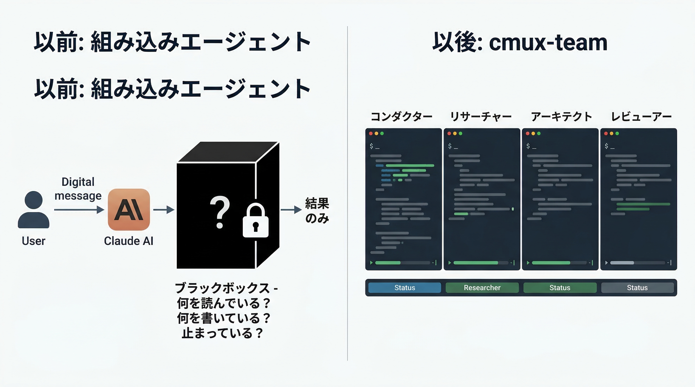
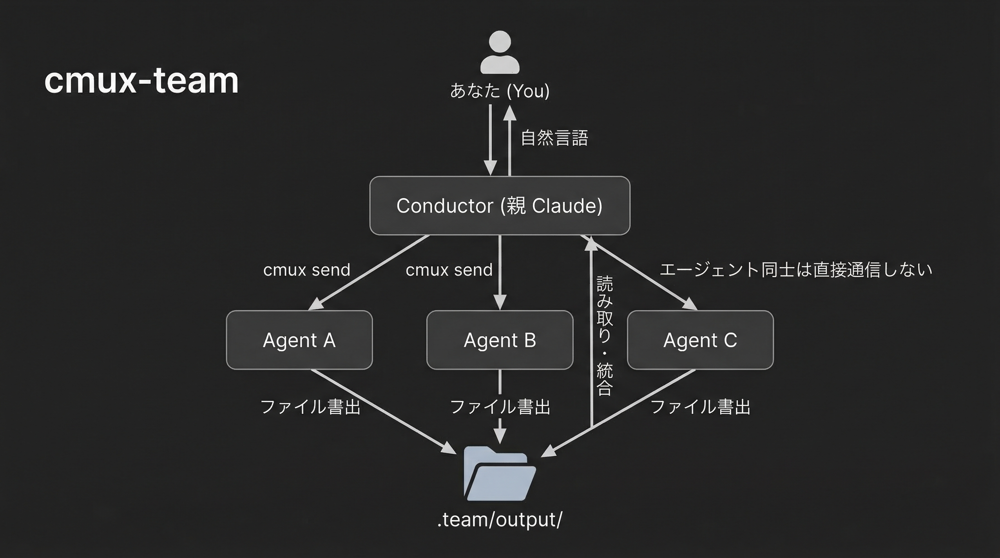

# cmux-team

[](LICENSE)

Claude Code + cmux によるマルチエージェント開発オーケストレーション。

**[English README](README.md)**

## なぜ cmux-team?

Claude Code の組み込みサブエージェント（Agent ツール）は便利ですが、**中で何をしているか見えません**。結果だけが返ってきて、途中経過はブラックボックスです。

cmux-team は、cmux のターミナル分割を使ってサブエージェントを**目に見える形で**並列実行します。



**あなたがやること**: Claude に自然言語で指示するだけ。
**Claude がやること**: cmux でペインを分割し、サブエージェントを起動・監視・統合。

## 前提条件

- [Claude Code](https://claude.ai/claude-code) がインストール済み
- [cmux](https://github.com/manaflow-ai/cmux) がインストール済み
- cmux 内で Claude Code を実行していること

## インストール

### プラグインとしてインストール（推奨）

```
# Marketplace を追加
/plugin marketplace add hummer98/cmux-team

# インストール
/plugin install cmux-team@hummer98-plugins
```

### 手動インストール（レガシー）

```bash
git clone https://github.com/hummer98/cmux-team.git
cd cmux-team
./install.sh
```

```bash
# インストール状態を確認
./install.sh --check

# アンインストール
./install.sh --uninstall
```

## 使い方

### 基本的な流れ

cmux を起動し、その中で Claude Code を起動します。あとは Claude に話しかけるだけです。

```
あなた: /team-init TODO アプリを作りたい
Claude: .team/ を初期化しました。次は /team-spec で要件を決めましょう。

あなた: /team-spec
Claude: どんな機能が必要ですか？（対話が始まる）
  ...壁打ちの後...
Claude: requirements.md を生成しました。

あなた: /team-research React vs Vue vs Svelte
Claude: 3つのリサーチャーを起動します。
  → 右にペインが3つ開き、それぞれが並列で調査開始
  → 調査の様子がリアルタイムで見える
  → 全員完了したら結果を統合して報告

あなた: /team-design
Claude: アーキテクトとレビュアーを起動します。
  → 設計 → レビュー → フィードバック反映 を自動で実行

あなた: /team-impl all
Claude: タスクを分割して実装エージェントを並列起動します。
  → 各エージェントがコードを書いている様子が見える

あなた: /team-status
Claude: 現在の状態を表示（各エージェントの進捗、イシュー数など）

あなた: /team-disband
Claude: 全エージェントを終了しました。
```

### コマンド一覧

| コマンド | やること | いつ使う |
|---------|---------|---------|
| `/team-init [説明]` | `.team/` を初期化 | プロジェクト開始時に1回 |
| `/team-spec [概要]` | 要件をブレスト | 何を作るか決める時 |
| `/team-research <トピック>` | 並列リサーチ（3エージェント） | 技術調査が必要な時 |
| `/team-design` | 設計 + レビュー | 要件が固まった後 |
| `/team-impl [タスク\|all]` | 並列実装 | 設計が固まった後 |
| `/team-review` | 実装レビュー | 実装が終わった後 |
| `/team-test [scope\|all]` | テスト作成・実行 | 実装・レビュー後 |
| `/team-sync-docs` | ドキュメント同期 | 仕様変更時 |
| `/team-issue [操作]` | イシュー管理 | 設計判断・課題の記録 |
| `/team-status` | チーム状態表示 | いつでも |
| `/team-disband [force]` | 全エージェント終了 | 作業完了時 |

### コマンドを使わなくても動く

スラッシュコマンドは必須ではありません。自然言語で指示すれば、Claude が適切なワークフローを判断します：

```
あなた: 認証機能の設計をして、レビューも並列でやって
あなた: このリポジトリのテスト構成を3人で調べて
あなた: 全エージェント止めて
```

## 人間の操作ポイント

### あなたがやること

1. **cmux を起動して Claude Code を立ち上げる**
2. **やりたいことを伝える**（自然言語 or スラッシュコマンド）
3. **サブエージェントのワークスペース（タブ）で動きを見る**（見てるだけでOK）
4. **結果の報告を受け取る**

### 介入が必要な場面

- **サブエージェントが止まっている**: cmux のペインをクリックして直接操作できます
- **方向性がおかしい**: Conductor（左ペイン）に「やめて」「方向転換して」と伝える
- **パーミッション確認が出た**: 後述のトラブルシューティング参照

### やらなくていいこと

- cmux コマンドを自分で打つ必要はありません（Claude が打ちます）
- サブエージェントの出力ファイルを読む必要はありません（Claude が統合します）
- team.json を編集する必要はありません

## プロジェクト内に作られるもの

`/team-init` を実行すると、プロジェクトに `.team/` ディレクトリが作られます：

```
.team/
├── team.json          # チーム状態（自動管理、手動編集不要）
├── specs/             # 仕様書（git tracked ← 残す価値あり）
│   ├── requirements.md
│   ├── design.md
│   └── tasks.md
├── issues/            # 設計判断・課題の記録（git tracked）
│   ├── open/
│   └── closed/
├── output/            # エージェント出力（一時的、gitignore）
├── prompts/           # 生成プロンプト（一時的、gitignore）
└── docs-snapshot/     # 同期用（一時的、gitignore）
```

`specs/` と `issues/` は git に含まれるので、設計判断の履歴が残ります。

## 並列構成

同時に動くエージェント数は用途に応じて自動調整されます：

| 構成 | エージェント数 | 使用場面 | 画面レイアウト |
|------|-------------|---------|--------------|
| Small | 1+3 (4体) | リサーチ、レビュー | Conductor 単独 + エージェント用ワークスペース1つ |
| Medium | 1+5 (6体) | 実装 + レビュー | Conductor 単独 + エージェント用ワークスペース2つ |
| Large | 1+7 (8体) | フルチーム | Conductor 単独 + エージェント用ワークスペース3つ |

Conductor（あなたとの会話）は常に単独ワークスペースに配置されます。
サブエージェントは別のワークスペース（cmux のタブ）に分散し、タブ切り替えで動きを確認できます。
cmux のサイドバーに各エージェントのステータスが表示されるので、タブを切り替えなくても進捗を把握できます。

## Hooks 設定（推奨）

`~/.claude/settings.json` に以下を追加すると、エージェントの完了時に cmux の通知リングが光ります：

```json
{
  "hooks": {
    "Notification": [
      {
        "matcher": "",
        "hooks": [
          {
            "type": "command",
            "command": "command -v cmux >/dev/null 2>&1 && cmux claude-hook notification || true"
          }
        ]
      }
    ],
    "Stop": [
      {
        "matcher": "",
        "hooks": [
          {
            "type": "command",
            "command": "command -v cmux >/dev/null 2>&1 && cmux claude-hook stop || true"
          }
        ]
      }
    ]
  }
}
```

## トラブルシューティング

### Conductor のペインが狭くなって動作しない

サブエージェントを同じワークスペースに分割すると、Conductor のペイン幅が不足して `cmux send` や画面読み取りが失敗します。

**対処**: サブエージェントは必ず別ワークスペースに配置してください。Conductor は単独ワークスペースに留まります。これは SKILL.md で指示済みですが、万一発生した場合は `/team-disband` で全エージェントを終了し、再実行してください。

### サブエージェントでパーミッション確認が出る

`--dangerously-skip-permissions` で起動しても、`.claude/commands/` や `.claude/skills/` への書き込み時に確認ダイアログが表示されます。

**対処**: 最初の確認で **「2. Yes, and allow Claude to edit its own settings for this session」** を選択してください。以降のセッション中は確認が出なくなります。

### `cmux read-screen` が「Surface is not a terminal」エラー

ワークスペース作成直後に発生することがあります。

**対処**: `cmux refresh-surfaces` を実行してからリトライしてください。

### サブエージェントが応答しない

API の過負荷（overloaded）でリトライ中の可能性があります。

**対処**:
1. cmux のサブエージェント用ワークスペースタブをクリックして画面を確認
2. 「Retrying...」と表示されていれば待つ
3. 完全に止まっていれば Esc でキャンセルし、`/team-disband` → 再実行

### サブエージェントのペインが増えすぎた

**対処**: `/team-disband` で全エージェントを一括終了できます。`/team-disband force` で強制終了。

### cmux 外で実行してしまった

cmux-team は cmux 内でのみ動作します。通常のターミナルで実行すると、ペイン分割や画面読み取りができません。

**対処**: cmux を起動してから Claude Code を立ち上げ直してください。

### 初回起動時に「Trust this folder?」確認が出る

新しいディレクトリで Claude を起動すると信頼確認が表示されます。サブエージェント側でも同様です。Conductor がこの確認を自動承認しますが、失敗する場合は手動でサブエージェントのペインをクリックして承認してください。

## 制約・既知の問題

- **API レート制限**: 複数エージェントが同時に API を叩くため、過負荷になりやすい。Claude Max 推奨。
- **Conductor のペイン幅**: Conductor はサブエージェントと同一ワークスペースに配置しないこと。ペイン幅不足で cmux コマンドが失敗する。
- **`cmux send` の改行**: 単一行テキストは `\n` で送信可能だが、**複数行テキストでは `\n` が改行として入力欄に追加されるだけで送信されない**。複数行の場合は `cmux send` の後に `cmux send-key return` が必要。Conductor はファイルパス指示（単一行）を使うことで回避している。
- **初回起動時の信頼確認**: 新しいディレクトリで Claude を起動すると「Trust this folder?」確認が出る。サブエージェント側でも同様。
- **セッション復帰**: サブエージェントがクラッシュした場合、`claude --resume <session-id>` で復帰可能だが、Conductor 側での自動検知は完全ではない。

## アーキテクチャ詳細

### スキル構成

| スキル | 誰が使う | 何をする |
|--------|---------|---------|
| `cmux-team` | Conductor（親 Claude） | エージェント起動・監視・結果統合の方法を知っている |
| `cmux-agent-role` | サブエージェント | 出力先・完了シグナル・ステータス報告の方法を知っている |

### 通信モデル



サブエージェント同士は直接通信しません。すべて `.team/` の共有ファイルか Conductor を介します。

### エージェントロール

| ロール | 担当 | 出力例 |
|--------|-----|--------|
| Researcher | 技術調査・事実収集 | 比較表、推奨事項 |
| Architect | 技術設計 | 設計書、Mermaid 図 |
| Reviewer | 品質チェック | Approved / Changes Requested |
| Implementer | コーディング | コード、変更ファイル一覧 |
| Tester | テスト作成・実行 | テストコード、実行結果 |
| DocKeeper | ドキュメント管理 | docs/ の更新差分 |
| IssueManager | 課題管理 | イシュー分類・要約 |

## 開発

### リポジトリ構造

```
cmux-team/
├── .claude-plugin/
│   ├── plugin.json                # プラグインマニフェスト
│   └── marketplace.json           # Marketplace カタログ
├── skills/
│   ├── cmux-team/
│   │   ├── SKILL.md               # Conductor 向けオーケストレーション知識
│   │   └── templates/             # エージェントプロンプトテンプレート (8個)
│   └── cmux-agent-role/
│       └── SKILL.md               # サブエージェント行動規範
├── commands/                      # スラッシュコマンド定義 (11個)
├── docs/seeds/                    # 設計シードドキュメント
├── install.sh                     # レガシーインストーラ（plugin 未対応環境向け）
├── LICENSE                        # MIT
├── README.md                      # 英語
└── README.ja.md                   # 日本語
```

## ライセンス

MIT License - 詳細は [LICENSE](LICENSE) を参照。
