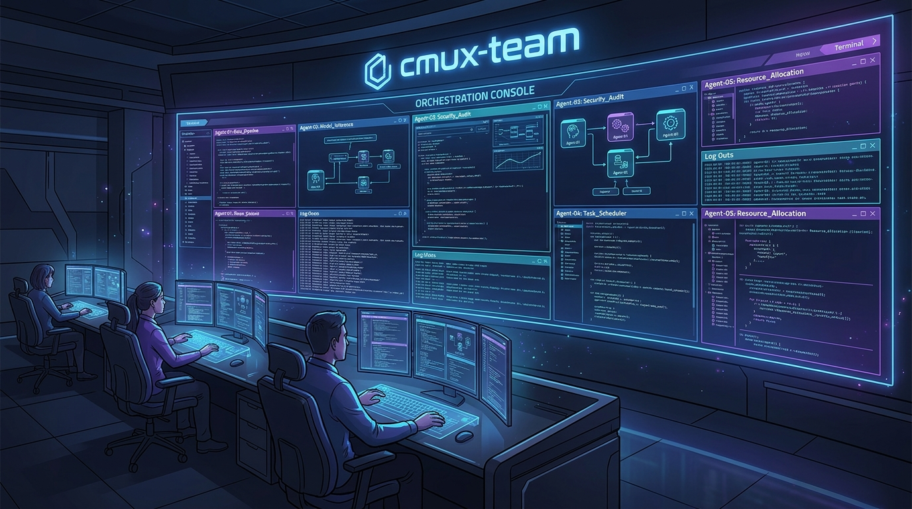

# cmux-team

[](LICENSE)

Multi-agent development orchestration with Claude Code + cmux.

**[日本語版 README はこちら](README.ja.md)**

## Why cmux-team?

Claude Code's built-in sub-agents (the Agent tool) are useful, but **you can't see what they're doing**. You only get the final result — the process is a black box.

cmux-team uses cmux's terminal splitting to run sub-agents **visibly** in parallel.

**What you do**: Just give Claude instructions in natural language.
**What Claude does**: Splits panes via cmux, launches sub-agents, monitors them, and integrates results.

## Prerequisites

- [Claude Code](https://docs.anthropic.com/en/docs/claude-code) installed
- [cmux](https://github.com/manaflow-ai/cmux) installed
- [bun](https://bun.sh/) installed (required for the Manager daemon)
- Running Claude Code inside a cmux session

## Installation

```bash
npm install -g @hummer98/cmux-team
```

## Usage

### Basic Workflow

Start cmux, launch Claude Code inside it.

```
You:    /cmux-team:start
  → Daemon starts with TUI dashboard
  → Master pane auto-created
  → Switch to Master pane to give tasks

You:    Build a TODO app with React
Claude: Task created.
  → Daemon detects task → spawns Conductor
  → Conductor spawns Agents in adjacent panes
  → Watch each agent working in real time

You:    How's it going?
Claude: (checks manager.log, cmux tree)
        Conductor-1: implementing (2/3 agents done)

You:    Also clean up worktrees (TODO)
Claude: → Sends TODO to queue via CLI
       → Daemon spawns new Conductor in parallel
```

### Commands

#### CLI Commands (run from terminal)

| Command | What it does | When to use |
|---------|-------------|-------------|
| `cmux-team start` | Start daemon + Master + Conductors | Once per session |
| `cmux-team status` | Show team status | Anytime |
| `cmux-team stop` | Graceful shutdown | When done |
| `cmux-team create-task` | Create a task | Task creation |

#### Slash Commands (run within Claude)

| Command | What it does | When to use |
|---------|-------------|-------------|
| `/cmux-team:master` | Reload Master role | After `/clear` |
| `/team-spec [summary]` | Brainstorm requirements | Deciding what to build |
| `/team-task [action]` | Task management | Record decisions |
| `/team-archive [range]` | Archive closed tasks | Task cleanup |

## Architecture

```
┌─────────────────────────────────────────┐
│  cmux-team daemon (TypeScript/bun)      │
│  ┌───────────────────────────────────┐  │
│  │  TUI Dashboard                    │  │
│  │  Tasks: 2 open | Conductors: 1/3  │  │
│  └───────────────────────────────────┘  │
│  Queue ← Master/Hook write via CLI      │
│  Loop  → Task scan → Conductor spawn    │
│  Monitor → Completion → Result collect   │
└───────────┬────────────┬────────────────┘
            │            │
     [Master]    [Conductor-035]
     Claude Code  Claude Code
     (Opus)       → [Agent] Claude Code
```

### Deterministic Manager

The Manager is **not** a Claude Code session. It's a TypeScript program with a deterministic event loop:

- **File queue** (`.team/queue/`) for communication (no `cmux send-key`)
- **zod** schema validation for all messages
- **ink** TUI dashboard
- **Task dependency resolution** via `depends_on` field
- **Priority sorting** (high > medium > low)

### Task Dependencies

```yaml
---
id: 13
title: Consolidated report
status: ready
depends_on: [10, 11, 12]  # waits for all to complete
---
```

### Communication

| Direction | Mechanism |
|-----------|-----------|
| Master → daemon | CLI (`main.ts send`) → `.team/queue/*.json` |
| daemon → Conductor | `cmux new-split` + Claude Code launch |
| Conductor → daemon | SessionEnd hook + `cmux list-status` polling |

## Troubleshooting

### Daemon won't start

**bun not installed**: `brew install oven-sh/bun/bun`

**Not in cmux**: Run inside cmux. `CMUX_SOCKET_PATH` must be set.

### Panes too narrow

Too many panes cause cmux commands to fail. Use `cmux-team stop` and set `CMUX_TEAM_MAX_CONDUCTORS=1` to limit concurrency.

### View Conductor session logs

```bash
grep conductor-xxx .team/logs/manager.log
# → task_completed ... session=abc-123
claude --resume abc-123
```

## Known Limitations

- **API rate limits**: Multiple concurrent agents. Claude Max recommended. Control with `CMUX_TEAM_MAX_CONDUCTORS` (default: 3).
- **Pane width**: Too many panes can break cmux commands.
- **Trust prompts**: New directories trigger trust confirmation. Conductor auto-approves but may need manual intervention.

## Contributing

See [CONTRIBUTING.md](CONTRIBUTING.md) for testing, repository structure, and coding conventions.

## License

MIT License — see [LICENSE](LICENSE) for details.
