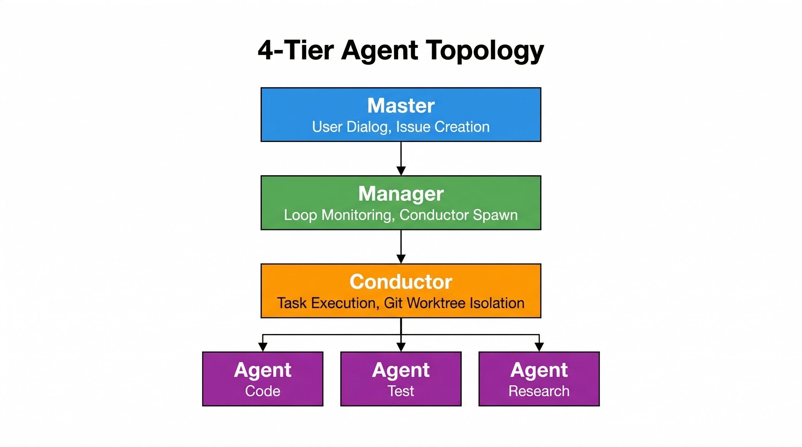
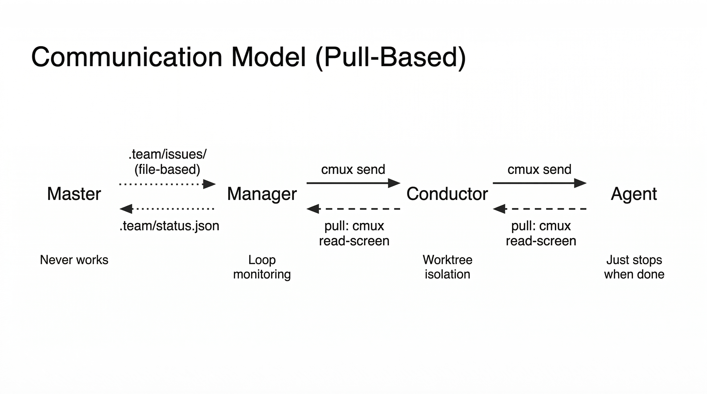

# cmux-team

[](LICENSE)

Multi-agent development orchestration with Claude Code + cmux.

**[日本語版 README はこちら](README.ja.md)**

## Why cmux-team?

Claude Code's built-in sub-agents (the Agent tool) are useful, but **you can't see what they're doing**. You only get the final result — the process is a black box.

cmux-team uses cmux's terminal splitting to run sub-agents **visibly** in parallel.


**What you do**: Just give Claude instructions in natural language.
**What Claude does**: Splits panes via cmux, launches sub-agents, monitors them, and integrates results.

## Prerequisites

- [Claude Code](https://docs.anthropic.com/en/docs/claude-code) installed
- [cmux](https://github.com/manaflow-ai/cmux) installed
- Running Claude Code inside a cmux session

## Installation

### As a Plugin (Recommended)

```
# Add marketplace
/plugin marketplace add hummer98/cmux-team

# Install
/plugin install cmux-team@hummer98-plugins
```

### Skills Only (via Agent Skills)

```bash
npx skills add hummer98/cmux-team
```

> **Note**: This installs skills only (no slash commands). You can still use all features via natural language (e.g. "research React vs Vue"), but `/team-*` commands won't be available. Use the plugin install above for the full experience.

### Manual Install (Legacy)

```bash
git clone https://github.com/hummer98/cmux-team.git
cd cmux-team
./install.sh
```

```bash
# Check installation status
./install.sh --check

# Uninstall
./install.sh --uninstall
```

## Usage

### Basic Workflow

Start cmux, launch Claude Code inside it, and just talk to Claude.

```
You:    /cmux-team:start
Claude: Team ready.
          [Master ✳]  |  [Manager ⚡]
        What would you like to do?

You:    Build a TODO app with React
Claude: Created task. Manager will pick it up.
  → Manager detects task → spawns Conductor
  → Conductor spawns Agents in adjacent panes
  → You can watch each agent working in real time

You:    How's it going?
Claude: (reads status.json)
        Conductor-1: implementing (2/3 agents done)

You:    Also add E2E tests
Claude: Created another task. Manager will assign it next.
```

You just talk to Master. Manager handles orchestration autonomously. Use individual commands for manual control:

```
You:    /cmux-team:start-status                              (check progress anytime)
You:    /cmux-team:start-disband                             (stop all agents)
You:    /cmux-team:start-research React vs Vue vs Svelte     (bypass Manager, run directly)
```

### Commands

| Command | What it does | When to use |
|---------|-------------|-------------|
| `/cmux-team:start` | Set up team (Master + Manager) | Once per session |
| `/team-spec [summary]` | Brainstorm requirements | When deciding what to build |
| `/team-research <topic>` | Parallel research (3 agents) | When technical research is needed |
| `/team-design` | Design + review | After requirements are set |
| `/team-impl [task\|all]` | Parallel implementation | After design is set |
| `/team-review` | Implementation review | After implementation |
| `/team-test [scope\|all]` | Create & run tests | After implementation/review |
| `/team-sync-docs` | Sync documentation | When specs change |
| `/team-task [action]` | Task management | Record design decisions & tasks |
| `/team-status` | Show team status | Anytime |
| `/team-disband [force]` | Terminate all agents | When done |

### Works Without Commands Too

Slash commands are optional. Claude will determine the appropriate workflow from natural language:

```
You: Design the auth feature and run review in parallel
You: Have 3 agents investigate this repo's test structure
You: Stop all agents
```

## What You Do (and Don't)

### Your role

1. **Start cmux and launch Claude Code**
2. **Tell it what you want** (natural language or slash commands)
3. **Watch sub-agents in their workspace tabs** (just watching is fine)
4. **Receive the integrated report**

### When to intervene

- **Agent is stuck**: Click its cmux pane and interact directly
- **Wrong direction**: Tell the Conductor (left pane) to stop or change course
- **Permission prompt appeared**: See Troubleshooting below

### What you don't need to do

- You don't need to type cmux commands yourself (Claude does it)
- You don't need to read agent output files (Claude integrates them)
- You don't need to edit team.json

## Project Structure Created

Running `/cmux-team:start` creates a `.team/` directory in your project:

```
.team/
├── team.json          # Team state (auto-managed, no manual editing)
├── specs/             # Specifications (git tracked — worth keeping)
│   ├── requirements.md
│   ├── design.md
│   └── tasks.md
├── tasks/             # Tasks & design decisions (git tracked)
│   ├── open/
│   └── closed/
├── output/            # Agent output (temporary, gitignored)
├── prompts/           # Generated prompts (temporary, gitignored)
└── docs-snapshot/     # Sync snapshots (temporary, gitignored)
```

`specs/` and `tasks/` are git-tracked, preserving your design decision history.

## Parallel Configurations

The number of concurrent agents is automatically adjusted by use case:

| Config | Agents | Use case | Layout |
|--------|--------|----------|--------|
| Small | 1+3 (4) | Research, review | Same workspace, split panes |
| Medium | 1+5 (6) | Implementation + review | Same workspace (or 2 if needed) |
| Large | 1+7 (8) | Full team | Split across 2 workspaces |

Sub-agents are placed next to the Conductor as split panes in the same workspace, so you can watch their progress in real time.
The cmux sidebar also shows each agent's status.

## Hooks Configuration (Recommended)

Add the following to `~/.claude/settings.json` to get cmux notification ring alerts when agents complete:

```json
{
  "hooks": {
    "Notification": [
      {
        "matcher": "",
        "hooks": [
          {
            "type": "command",
            "command": "command -v cmux >/dev/null 2>&1 && cmux claude-hook notification || true"
          }
        ]
      }
    ],
    "Stop": [
      {
        "matcher": "",
        "hooks": [
          {
            "type": "command",
            "command": "command -v cmux >/dev/null 2>&1 && cmux claude-hook stop || true"
          }
        ]
      }
    ]
  }
}
```

## Architecture

### Skill Structure (4-Tier Architecture)

| Skill | Used by | Purpose |
|-------|---------|---------|
| `cmux-team` | Master | 4-tier architecture definition, Master behavior |
| `cmux-agent-role` | Agent | Output protocol, work boundaries |

### 4-Tier Topology



### Communication Model (Pull-Based)



The system uses a 4-tier architecture: **Master > Manager > Conductor > Agent**. Communication is pull-based — upper tiers monitor lower tiers by reading their status files rather than receiving push notifications. All coordination uses file-based communication through `.team/`. Agents never communicate directly with each other.

**Manager specifics**: Runs on Sonnet model (`--model sonnet`). Idles when no tasks are available; wakes on `[TASK_CREATED]` notification from Master. Conductor spawning is delegated to `.team/scripts/spawn-conductor.sh`. History is logged to `.team/logs/manager.log`.

### Agent Roles

| Role | Responsibility | Example Output |
|------|---------------|----------------|
| Manager | Task monitoring (event-driven), Conductor spawning, result collection | status.json, manager.log |
| Conductor | Task orchestration, Agent management, worktree isolation | summary.md, test results |
| Researcher | Technical research & fact gathering | Comparison tables, recommendations |
| Architect | Technical design | Design docs, Mermaid diagrams |
| Reviewer | Quality checks | Approved / Changes Requested |
| Implementer | Coding | Code, list of changed files |
| Tester | Test creation & execution | Test code, execution results |
| DocKeeper | Documentation management | docs/ diffs |
| Task Manager | Task management | Task triage & summaries |

## Troubleshooting

### Conductor pane becomes too narrow

Too many panes in the same workspace can cause pane width issues, breaking `cmux send` and screen reading.

**Fix**: Reduce the number of panes, or split agents across multiple workspaces. Run `/team-disband` and retry with fewer agents.

### Permission prompts in sub-agents

Even with `--dangerously-skip-permissions`, permission dialogs may appear when writing to `.claude/commands/` or `.claude/skills/`.

**Fix**: Select **"2. Yes, and allow Claude to edit its own settings for this session"** at the first prompt.

### `cmux read-screen` returns "Surface is not a terminal"

Can occur immediately after workspace creation.

**Fix**: Run `cmux refresh-surfaces` then retry.

### Sub-agent not responding

May be retrying due to API overload.

**Fix**:
1. Click the sub-agent's workspace tab to check its screen
2. If "Retrying..." is shown, wait
3. If completely stuck, press Esc to cancel, then `/team-disband` → retry

### Too many sub-agent panes

**Fix**: `/team-disband` terminates all agents at once. Use `/team-disband force` for forced termination.

### Running outside cmux

cmux-team only works inside cmux. Pane splitting and screen reading won't work in a regular terminal.

**Fix**: Start cmux first, then launch Claude Code inside it.

### "Trust this folder?" prompt on first launch

New directories trigger a trust confirmation in Claude. Sub-agents may also show this. The Conductor auto-approves it, but if it fails, manually click the sub-agent pane and approve.

## Known Limitations

- **API rate limits**: Multiple agents hitting the API simultaneously can cause overload. Claude Max recommended.
- **Pane width**: Too many panes in one workspace can cause cmux commands to fail. Reduce pane count or split across workspaces.
- **`cmux send` newlines**: Single-line text can be sent with `\n`, but **multi-line text requires `cmux send` followed by `cmux send-key return`**. The Conductor works around this by using file path instructions (single line).
- **First-launch trust prompt**: New directories trigger a "Trust this folder?" confirmation in Claude, including for sub-agents.
- **Session recovery**: Crashed sub-agents can be resumed with `claude --resume <session-id>`, but the Conductor's auto-detection is not fully reliable.

## Development

### Repository Structure

```
cmux-team/
├── .claude-plugin/
│   ├── plugin.json                # Plugin manifest
│   └── marketplace.json           # Marketplace catalog
├── skills/
│   ├── cmux-team/
│   │   ├── SKILL.md               # 4-tier architecture definition
│   │   └── templates/             # Agent prompt templates (10)
│   └── cmux-agent-role/
│       └── SKILL.md               # Sub-agent behavior protocol
├── commands/                      # Slash command definitions (11)
├── docs/seeds/                    # Design seed documents
├── install.sh                     # Legacy installer (for non-plugin environments)
├── LICENSE                        # MIT
├── README.md                      # English
└── README.ja.md                   # Japanese
```

## License

MIT License — see [LICENSE](LICENSE) for details.
