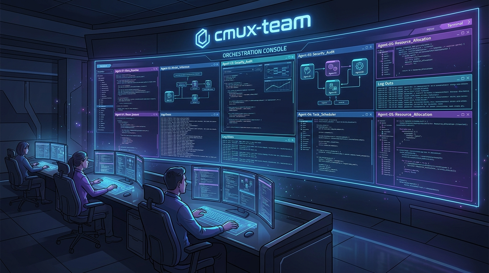

# cmux-team

[](LICENSE)

Multi-agent development orchestration with Claude Code + cmux.

**[日本語版 README はこちら](README.ja.md)**

## Why cmux-team?

Claude Code's built-in sub-agents (the Agent tool) are useful, but **you can't see what they're doing**. You only get the final result — the process is a black box.

cmux-team uses cmux's terminal splitting to run sub-agents **visibly** in parallel.

**What you do**: Just give Claude instructions in natural language.
**What Claude does**: Splits panes via cmux, launches sub-agents, monitors them, and integrates results.

## Prerequisites

- [Claude Code](https://docs.anthropic.com/en/docs/claude-code) installed
- [cmux](https://github.com/manaflow-ai/cmux) installed
- [bun](https://bun.sh/) installed (required for the Manager daemon)
- Running Claude Code inside a cmux session
- [Nerd Font](https://www.nerdfonts.com/) (recommended) — enhances TUI dashboard icons
  ```bash
  brew install --cask font-hack-nerd-font
  ```
  Works without Nerd Font (falls back to Unicode symbols). Set `CMUX_NERD_FONT=0` to use fallback icons explicitly.

## Installation

```bash
npm install -g @hummer98/cmux-team
```

### About auto-update

The daemon **detects** new versions via `update-notifier` and surfaces them in the TUI banner. **Install is always manual** — run `npm i -g @hummer98/cmux-team@<latest>` yourself to avoid surprises across mixed Node environments (Volta / nvm / Homebrew).

Two modes (default: `off`):

| mode | behavior |
|------|----------|
| `off` | do nothing (no registry access) |
| `notify` | detect every 12h and show a TUI banner; no install |

Configuration (precedence: **env > config > default**):

- `CMUX_TEAM_AUTO_UPDATE=off|notify` (also accepts `0|false` as off)
- `.team/config.json`: `{ "autoUpdate": "off" | "notify" }`

Related:
- `NO_UPDATE_NOTIFIER=1` disables detection (standard update-notifier env var)
- Boot log: `auto_update_config mode=<mode> source=<env|config|default>`

**Breaking change (v4.5.0, T294):**
- The `task` mode (auto-creation of update tasks) is removed. `CMUX_TEAM_AUTO_UPDATE=task|1|true` and `.team/config.json: autoUpdate: "task" | true | false` now exit with status 1.
- The `cmux-team self-update` subcommand is removed.
- Migration: set `autoUpdate` to `notify` (or `off`), then run `npm install -g @hummer98/cmux-team@latest` when the banner appears.

## Usage

### Basic Workflow

Start cmux, launch Claude Code inside it.

```
$ cmux-team start
  → Daemon starts with TUI dashboard
  → Manager / Master panes created, Conductors spawned
  → Switch to Master pane to give tasks

You:    Build a TODO app with React
Claude: Task created.
  → Daemon detects task → assigns to an idle Conductor
  → Conductor spawns Agents as tabs in the same pane
  → Watch each agent working in real time

You:    How's it going?
Claude: (checks manager.log, cmux tree)
        Conductor-1: implementing (2/3 agents done)

You:    Also clean up worktrees
Claude: → cmux-team create-task --title "..." --status ready
       → Daemon assigns it to another idle Conductor in parallel
```

### Commands

#### CLI Commands (run from terminal)

See `cmux-team --help` for the full list. Common commands:

**Lifecycle**
| Command | What it does |
|---------|-------------|
| `cmux-team start` | Start daemon + Master + Conductors (self-heals if layout got lost) |
| `cmux-team status` | Show team status |
| `cmux-team --version` | Show version |

> Note: `cmux-team stop` was removed in v4.3.0. The daemon auto-stops when the cmux session exits (pidfile release). To terminate manually: `kill <pid>` (see `.team/daemon.pid`).

**Task management**
| Command | What it does |
|---------|-------------|
| `cmux-team create-task --title <t> [--status ready] [--body <b>] [--depends-on <ids>] [--run-after-all] [--exclusive]` | Create a task (`--exclusive`: run alone after drain; implies `--run-after-all`) |
| `cmux-team update-task --task-id <id> --status <s>` | Update task status |
| `cmux-team close-task --task-id <id> [--journal <text>]` | Close a task |
| `cmux-team abort-task --task-id <id>` | Abort a running task |
| `cmux-team restart-task --task-id <id>` | Restart an assigned Conductor session |
| `cmux-team delete-task --task-id <id>` | Delete a draft/ready task |
| `cmux-team await-task --task-id <id> [--timeout <sec>]` | Wait for task completion |

**Agent / Conductor**
| Command | What it does |
|---------|-------------|
| `cmux-team spawn-conductor` | Spawn and register a single Conductor |
| `cmux-team spawn-agent --conductor-surface <s> --role <r> --prompt <p>` | Spawn an Agent tab |
| `cmux-team agents` | List running agents |
| `cmux-team kill-agent --surface <s>` | Terminate an Agent |
| `cmux-team send-agent --surface <s> <message>` | Send a message to Agent / Conductor |
| `cmux-team conductor` | Boot Conductor role (proxy auto-resolved) |
| `cmux-team spawn-master` | Boot Master role (proxy auto-resolved) |

**Diagnostics**
| Command | What it does |
|---------|-------------|
| `cmux-team trace-task <task-id>` | Show session history for a task |
| `cmux-team artifacts [add\|show\|open\|search]` | Manage knowledge artifacts |

#### Slash Commands (run within Claude)

| Command | What it does | When to use |
|---------|-------------|-------------|
| `/master` | Reload Master role | After `/clear` |
| `/team-spec [summary]` | Brainstorm requirements | Deciding what to build |
| `/team-task [action]` | Task management | Create / list / close tasks |
| `/team-archive [range]` | Archive closed tasks | Task cleanup |
| `/artifact [type] [title]` | Save findings as artifact | Knowledge capture |
| `/docs-sync [--dry-run\|--auto]` | Sync `docs/spec/` with implementation | Doc maintenance |
| `/trace-task <task-id>` | Analyze a task's session history | Debugging, review |

## Architecture

```
┌─────────────────────────────────────────┐
│  cmux-team daemon (TypeScript/bun)      │
│  ┌───────────────────────────────────┐  │
│  │  TUI Dashboard                    │  │
│  │  Tasks: 2 open | Conductors: 1/3  │  │
│  └───────────────────────────────────┘  │
│  Queue ← Master/Hook write via CLI      │
│  Loop  → Task scan → Conductor spawn    │
│  Monitor → Completion → Result collect   │
└───────────┬────────────┬────────────────┘
            │            │
     [Master]    [Conductor-035]
     Claude Code  Claude Code
     (Opus)       → [Agent] Claude Code
```

### Deterministic Manager

The Manager is **not** a Claude Code session. It's a TypeScript program with a deterministic event loop:

- **HTTP message queue** via the built-in proxy (`cmux-team send <TYPE>`) — event-driven, not polling
- **File-based task state** (`.team/tasks/` + `task-state.json`)
- **zod** schema validation for all messages
- **ink** TUI dashboard
- **Task dependency resolution** via `depends_on` field
- **Priority sorting** (high > medium > low)
- **Agent completion via fs.watch** — Agent's Stop / SessionEnd hook writes a done marker, Conductor awaits it with `cmux-team await-agent` (no busy polling, T181)

### Task Dependencies

```yaml
---
id: 13
title: Consolidated report
status: ready
depends_on: [10, 11, 12]  # waits for all to complete
---
```

### Communication

| Direction | Mechanism |
|-----------|-----------|
| Master → daemon | `cmux-team send <TYPE>` → HTTP message to proxy |
| daemon → Conductor | `cmux send` (`/clear` + new prompt on a persistent Conductor pane) |
| daemon ← Conductor | Done marker file (`.team/conductors/<id>/done`) + SESSION_* hook messages |
| Conductor → Agent | `cmux-team send-agent` / `spawn-agent` (direct `cmux send` is blocked by hook) |
| Conductor ← Agent | `cmux-team await-agent` (fs.watch on Agent done marker) |

## Project-Specific Agent Instructions

You can give each Agent role (researcher / architect / planner / design-reviewer / implementer / inspector / dockeeper / task-manager) a project-local overlay by writing `.team/agent-instructions/<role>.md`. The overlay content is injected into the Agent's prompt at spawn time.

```bash
# Write an overlay
cmux-team set-agent-instructions --role implementer --from-file ./my-impl-notes.md
cmux-team set-agent-instructions --role researcher --body "Limit search to papers from 2025 onward"

# Inspect / list
cmux-team get-agent-instructions --role implementer
cmux-team list-agent-instructions

# Delete (idempotent)
cmux-team delete-agent-instructions --role implementer
```

Max overlay size is 100 KB. The dashboard's `Settings` tab (`4` key) shows a read-only preview of all role overlays plus a config snapshot.

## Traceability

All API requests are automatically recorded through the built-in proxy when the daemon is running.

### Inspecting a Task's Sessions

```bash
# Show session history for a specific task (Conductor + Agents)
cmux-team trace-task 035
```

Traces are stored in `.team/traces/traces.db` with request/response bodies in `.team/logs/traces/bodies/`. Metadata headers (`x-cmux-task-id`, `x-cmux-conductor-surface`, `x-cmux-role`) are propagated so every API request can be correlated with its originating task.

## Troubleshooting

### Daemon won't start

**bun not installed**: `brew install oven-sh/bun/bun`

**Not in cmux**: Run inside cmux. `CMUX_SOCKET_PATH` must be set.

### Panes too narrow

Too many panes cause cmux commands to fail. Exit the cmux session (daemon auto-stops) and restart with `CMUX_TEAM_MAX_CONDUCTORS=1` to limit concurrency.

### View Conductor session logs

```bash
grep conductor-xxx .team/logs/manager.log
# → task_completed ... session=abc-123
claude --resume abc-123
```

## Known Limitations

- **API rate limits**: Multiple concurrent agents. Claude Max recommended. Control with `CMUX_TEAM_MAX_CONDUCTORS` (default: 3).
- **Pane width**: Too many panes can break cmux commands.
- **Trust prompts**: New directories trigger trust confirmation. Conductor auto-approves but may need manual intervention.

## Contributing

See [CONTRIBUTING.md](CONTRIBUTING.md) for testing, repository structure, and coding conventions.

## License

MIT License — see [LICENSE](LICENSE) for details.
