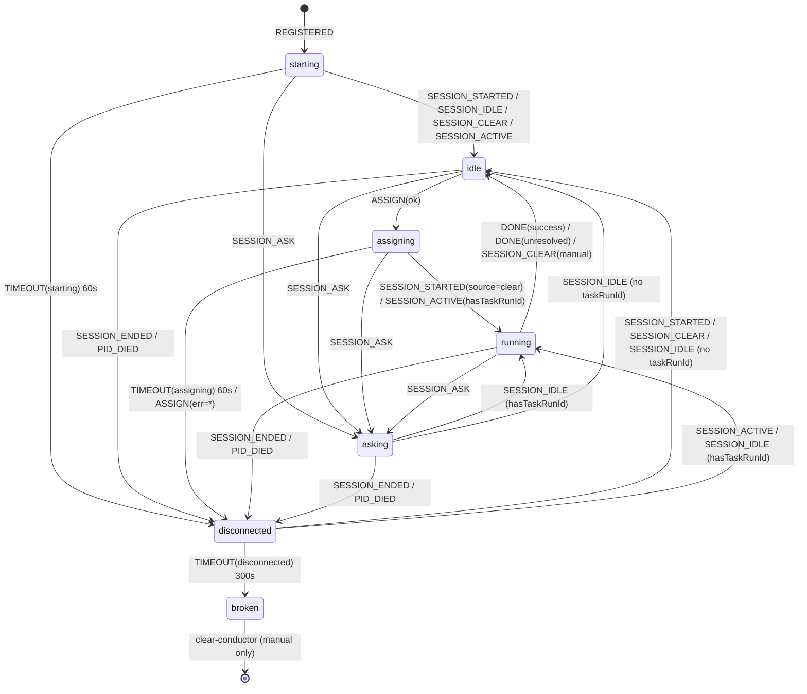
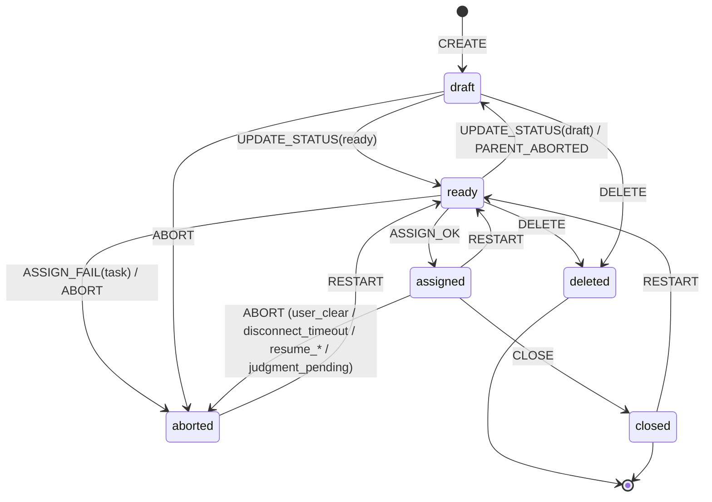

# 07. Conductor / Task state machine

> T279 で追加。Conductor と Task の状態・イベント・遷移を仕様として成文化する。
> 運用時のスナップショット (現状調査) は `.team/artifacts/A017-state-machine.md` を参照。
> 実装は `skills/cmux-team/manager/state-machine/` (pure reducer) と
> `skills/cmux-team/manager/daemon.ts` (実 state mutation)。

## 0. 読み方

- **状態** は Conductor (7 値) / Task (6 値) の 2 軸で独立管理する。
- **イベント** は daemon への入力 (hook / CLI / timer) に対応する。
- **reducer** (`conductor-fsm.ts` / `task-fsm.ts`) は純関数。`shadow.ts` が
  daemon の各ハンドラ末尾から reducer を呼び、期待次状態と実 state を比較して
  `fsm_shadow_diff` ログに記録する (P1 observe mode)。副作用は daemon 側でのみ実行される。
- 本ドキュメントの遷移は **reducer 実装が正**。A017 (調査スナップショット) との
  差分は A017 §5 correction section で管理する。

## 1. Conductor FSM

### 1.1 状態一覧 (7 値)

`schema.ts` の `ConductorState.status` に対応。

| 状態 | 意味 | 入口例 |
|------|------|-------|
| `starting` | `CONDUCTOR_REGISTERED` 直後。Claude プロセス未確認 | 初回登録 |
| `idle` | タスク割当可能。Claude セッション確立済 | `SESSION_STARTED` 到達 / `resetConductor` |
| `assigning` | `assignTask` が `/clear` 送信済みで SESSION_STARTED 未到達 | `scanTasks` → `assignTask` |
| `running` | タスク実行中 (ユーザー入力/ツール呼び出し/思考中) | `SESSION_STARTED(source=clear)` in assigning |
| `asking` | `AskUserQuestion` 受信 (Notification hook) | `SESSION_ASK` |
| `disconnected` | Claude プロセス不在 / SessionEnd / PID 死 | `SESSION_ENDED` / PID watcher |
| `broken` | disconnected 300s 超過で自動復帰停止 (T250) | `monitorConductors` timeout |

`broken` は **終端状態**。`cmux-team clear-conductor` のみで解除される。

### 1.2 遷移表

イベント × 現状態 → 次状態の真偽表。`—` は state 遷移なし (no-op)。

| event \ state | `starting` | `idle` | `assigning` | `running` | `asking` | `disconnected` | `broken` |
|---|---|---|---|---|---|---|---|
| `REGISTERED` | — | — | — | — | — | — | — |
| `SESSION_STARTED` (not master) | `idle` | — | `running` | — | — | `idle` | — |
| `SESSION_IDLE` | `idle` | — | — | — | `running`/`idle` [^1] | `running`/`idle` [^1] | — |
| `SESSION_CLEAR` (daemon) | `idle` | — | — (assigning 維持) | log only | — | `idle` | — |
| `SESSION_CLEAR` (manual) | `idle` | — | — (assigning 維持) | `idle` + task abort | — | `idle` | — |
| `SESSION_ACTIVE` | `idle` | — | `running` [^2] | — | — | `running` | — |
| `SESSION_ASK` | `asking` | `asking` | `asking` | `asking` | — | `asking` | — |
| `SESSION_ENDED` (stop) | `disconnected` | `disconnected` | `disconnected` | `disconnected` | `disconnected` | — | — |
| `SESSION_ENDED` (other) | — | — | — | — | — | — | — |
| `PID_DIED` | `disconnected` | `disconnected` | `disconnected` | `disconnected` | `disconnected` | — | — |
| `TIMEOUT(starting)` | `disconnected` | — | — | — | — | — | — |
| `TIMEOUT(assigning)` | — | — | `disconnected` | — | — | — | — |
| `TIMEOUT(disconnected)` | — | — | — | — | — | `broken` | — |
| `ASSIGN(ok)` | — | `assigning` | — | — | — | — | — |
| `ASSIGN(err=task)` | — | — | `disconnected` [^3] | — | — | — | — |
| `ASSIGN(err=conductor)` | `disconnected` | `disconnected` | `disconnected` | `disconnected` | `disconnected` | — | — |
| `DONE(success=true)` | — | — | — | `idle` [+close_task_auto if assigned] | `idle` | — | — |
| `DONE(unresolved)` | — | — | — | `idle` [+abort_task, preserveWorktree] | `idle` | — | — |
| `CLEAR_MANUAL` [^4] | — | — | — | `idle` | `idle` | — | — |

[^1]: `ctx.hasTaskRunId` が真なら `running`、偽なら `idle` (T181/T263 経路)。
[^2]: `ctx.hasTaskRunId` が真のときのみ `running`。偽なら no-op (assigning 維持)。
[^3]: state が `assigning` のときのみ (daemon.ts R2 保険)。
[^4]: 予約イベント。現在 emit 箇所なし (SESSION_CLEAR.manualUserInitiated で同等表現)。

### 1.3 タイムアウト定数

| 定数 | 既定 | env override | 対応 event |
|------|-----|-------------|-----------|
| `STARTING_TIMEOUT_SEC` | 60 | (なし) | `TIMEOUT(starting)` |
| `ASSIGNING_TIMEOUT_SEC` | 60 | (なし) | `TIMEOUT(assigning)` |
| `DISCONNECT_TIMEOUT_SEC` | 300 | `CMUX_TEAM_DISCONNECT_TIMEOUT_SEC` | `TIMEOUT(disconnected)` |

### 1.4 状態遷移図 (Mermaid)



### 1.5 不変条件

| ID | 条件 | 監視位置 |
|----|------|---------|
| C-I1 | `status=running` ⇒ `taskRunId != null` | `checkConductorInvariants` |
| C-I2 | `status=broken` ⇒ `taskRunId == null` | `checkConductorInvariants` |
| C-I3 | `broken` 解除は `clear-conductor` のみ | reducer は `broken` で全 event no-op |

違反は `fsm_invariant_violation` ログに出る (P1 は log only、強制修正しない)。

## 2. Task FSM

### 2.1 状態一覧 (6 値)

| 状態 | 意味 | 入口例 |
|------|------|-------|
| `draft` | 下書き (assign されない) | `create-task` デフォルト / 親 abort cascade |
| `ready` | 実行待ち (assignable) | `update-task --status ready` / `restart-task` |
| `assigned` | Conductor に割り当て済 | `assignTask` 成功 |
| `closed` | 正常完了（T295 以降は `deliverable` 必須。CLI 経由は `--deliverable-kind <files\|merged\|pr\|none>`、auto-close 経路は `kind: "none"` を daemon が自動付与） | `close-task` CLI / T274 auto-close |
| `aborted` | 中止 (人為 or 自動) | `abort-task` / 各 cascade |
| `deleted` | 明示削除 (終端) | `delete-task` (draft/ready のみ) |

`closed` / `aborted` / `deleted` は半終端 (restart で `ready` に戻せるのは
`aborted` / `closed` のみ。`deleted` は復活不可な終端)。

### 2.2 遷移表

| event \ state | `draft` | `ready` | `assigned` | `closed` | `aborted` | `deleted` |
|---|---|---|---|---|---|---|
| `CREATE` | — | — | — | — | — | — |
| `UPDATE_STATUS(to=ready)` | `ready` | — | — | — | — | — |
| `UPDATE_STATUS(to=draft)` | — | `draft` | — | — | — | — |
| `ASSIGN_OK` | — | `assigned` | — | — | — | — |
| `ASSIGN_FAIL(kind=task)` | — | `aborted` +cascade | — | — | — | — |
| `ASSIGN_FAIL(kind=conductor)` | — | — | — | — | — | — |
| `CLOSE` | `closed` | `closed` | `closed` | — | — | — |
| `ABORT` | `aborted` +cascade | `aborted` +cascade | `aborted` +cascade | — | — | — |
| `DELETE` | `deleted` +cascade | `deleted` +cascade | — | — | — | — |
| `RESTART` | — | — | — | `ready` | `ready` | — |
| `PARENT_ABORTED` | — | `draft` | — | — | — | — |

### 2.3 状態遷移図 (Mermaid)



### 2.4 cascade ルール (T241)

親タスクが `aborted` / `deleted` に遷移したとき:

- **`ready` 子**: `draft` に戻す (journal: `parent_aborted: <parentId>`)
- **`draft` / `assigned` / `closed` / `aborted` / `deleted` 子**: 変更なし

cascade 発火経路は 7 本 (CLAUDE.md「依存タスクの cascade」参照):

1. `abort-task` CLI
2. `delete-task` CLI
3. Conductor forced close (disconnect timeout)
4. user_clear (手動 /clear)
5. `assign_failed` (worktree 作成失敗等)
6. `resume_marked_aborted` (cmdStart 起動時、T264)
7. `handleConductorDone` unresolved 分岐 (T269)

### 2.5 不変条件

| ID | 条件 | 監視位置 |
|----|------|---------|
| T-I1 | `status=assigned` ⇒ `hasConductor=true` | `checkTaskInvariants` |
| T-I2 | `PARENT_ABORTED` は `ready` にのみ作用 | reducer 側の state guard |

## 3. Conductor ↔ Task の同時遷移

両 FSM は独立だが、以下の経路で密に連動する:

| シナリオ | Conductor | Task | 実装 |
|---------|-----------|------|------|
| 割当 | `idle → assigning` | `ready → assigned` | `scanTasks` + `assignTask` |
| 正常完了 | `running → idle` | `assigned → closed` | `close-task` → `CONDUCTOR_DONE success=true` |
| T274 auto-close | `running → idle` | `assigned → closed` | `CONDUCTOR_DONE success=true` + state still `assigned` |
| judgment_pending (T269) | `running → idle` | `assigned → aborted` + cascade | `CONDUCTOR_DONE success=false unresolved=true` (preserveWorktree) |
| user_clear | `running → idle` | `assigned → aborted` + cascade | `SESSION_CLEAR(manualUserInitiated)` |
| disconnect timeout | `disconnected → broken` | `assigned → aborted` + cascade | `forceCloseDisconnectedConductor` |
| 起動時 resume 不可 | (N/A) | `assigned → aborted(resume_*)` + cascade | `applyResumeTransitions` (T264) |

## 4. shadow observability 配線

daemon.ts の各ハンドラ末尾で `shadowObserveConductor(...)` を呼び、
reducer 計算結果と実 state を比較する。差分は `fsm_shadow_diff` ログに記録
(state 変更はしない)。

配線箇所:

| 配線箇所 | 対応 event | 備考 |
|---------|-----------|------|
| `handleMessage:SESSION_STARTED` | `SESSION_STARTED` | Master surface は ctx.isMasterSurface で no-op |
| `handleMessage:SESSION_IDLE` | `SESSION_IDLE` | T181 / T277 分岐 |
| `handleMessage:SESSION_CLEAR` | `SESSION_CLEAR(manualUserInitiated)` | running + taskRunId 一致時に manual=true |
| `handleMessage:SESSION_ACTIVE` | `SESSION_ACTIVE` | ctx.hasTaskRunId で分岐 |
| `handleMessage:SESSION_ASK` | `SESSION_ASK` | 全状態 → asking |
| `handleMessage:SESSION_ENDED` | `SESSION_ENDED` | reason=other は no-op |
| `handleMessage:CONDUCTOR_REGISTERED` | `REGISTERED` | 新規/idempotent-skip 両方で `starting → starting` no-op |
| `handleConductorDone` | `DONE` | currentTaskStatus を ctx で渡し T274 分岐 |
| `__testSpawnPidWatcherTick` | `PID_DIED` | PID 死検出時 |
| `monitorConductors(starting)` | `TIMEOUT(starting)` | 60s |
| `monitorConductors(assigning)` | `TIMEOUT(assigning)` | 60s |
| `monitorConductors(disconnected)` | `TIMEOUT(disconnected)` | 300s |
| `scanTasks(assign)` | `ASSIGN(ok)` / `ASSIGN(err=*)` | エラー経路は errorKind で分岐 |

shadow ログフォーマット:

```
[<ts>] fsm_shadow_diff C[<surface>] scope=conductor event=<TYPE> prev=<s> expected=<s> actual=<s>
[<ts>] fsm_shadow_action C[<surface>] scope=conductor type=<action> detail=<json>
[<ts>] fsm_invariant_violation C[<surface>] scope=conductor state=<s> violation=<rule>
```

## 5. 段階計画

| フェーズ | 範囲 | リリース条件 |
|---------|-----|-------------|
| **P0** | 現状記述 (A017) | 完了 |
| **P1 (T279, 本タスク)** | 仕様成文化 + pure reducer + shadow observer + 136 単体テスト | 24h runtime で `fsm_shadow_diff` = 0 |
| **P2 (T280 予定)** | daemon 側 state mutation を reducer の `{next, actions}` で置換 | shadow 合格後 |

P1 から P2 へは「shadow 期間中に `fsm_shadow_diff` が 0 件 (or 設計上の既知差分のみ)」
の 24h 観測を経てから進める。差分は A017 §5 correction section に記録する。

## 関連

- A017: 運用時スナップショット (現状調査)
- T250: `broken` 状態追加
- T263 / T269: `CONDUCTOR_DONE` の state 遷移
- T264: 起動時 resume 不可検出
- T274: T274 auto-close
- T276 / T277: `SESSION_IDLE/CLEAR` race 修正
- CLAUDE.md「EventBus ポリシー」「タスク属性」「エラーリカバリ」
